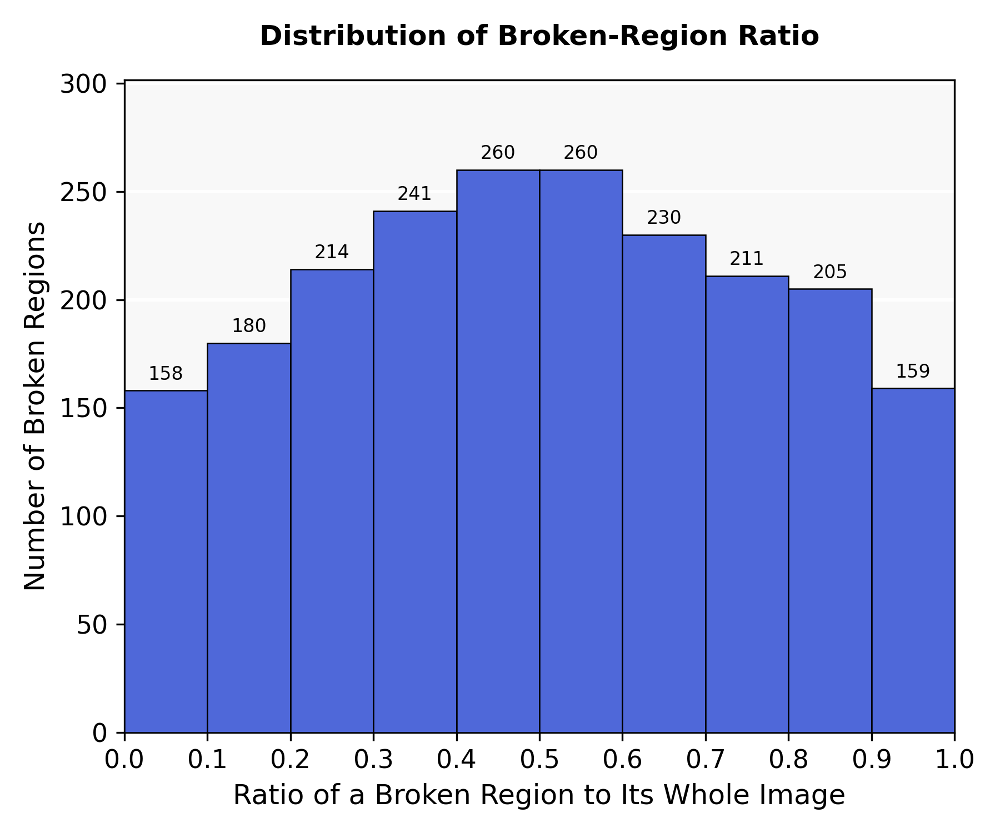

# Ratio of a Broken Region to Its Whole Image

统计当前 `mydata` 固定 train / val / test 中实际存在图片所对应的 GT 标签，不扫描标签目录里的孤立旧文件。定义为每一个破损玻璃 GT **bounding box** 的面积占整图面积：

\[
r=\frac{w_{\mathrm{bbox}}h_{\mathrm{bbox}}}{W_{\mathrm{image}}H_{\mathrm{image}}}.
\]

YOLO 标签的宽高已经归一化，因此实现中等价于 `normalized_width × normalized_height`。横轴固定 0–1.0，按照 0–0.1、0.1–0.2、…、0.9–1.0 划分为 10 个等宽区间（bin width=0.1）；相邻柱子无间隙，纵轴为 GT 破损区域框数量。图中没有图例，采用接近方形的画布，并沿用用户给出的浅灰背景、白色水平网格、蓝色黑边柱和柱顶数值。

| split | 图片 | 正样本图片 | 背景图片 | GT 框 |
|---|---:|---:|---:|---:|
| Train | 1,832 | 1,421 | 411 | 1,462 |
| Val | 503 | 407 | 96 | 422 |
| Test | 1,598 | 206 | 1,392 | 234 |
| 合计 | 3,933 | 2,034 | 1,899 | 2,118 |

全部 2,118 个框的均值为 0.503081，median 为 0.501827，min / max 为 0.000866 / 0.999447。这里是矩形框面积占比，不是破损像素 mask 面积；若论文要表述“实际破损区域像素比例”，需要 segmentation mask，不能用此图替代。

下载：[PNG](assets/dataset_statistics/broken_region_ratio_distribution.png) · [SVG](assets/dataset_statistics/broken_region_ratio_distribution.svg) · [PDF](assets/dataset_statistics/broken_region_ratio_distribution.pdf) · [10-bin CSV](assets/dataset_statistics/broken_region_ratio_distribution.csv) · [统计 JSON](assets/dataset_statistics/broken_region_ratio_distribution.json)。可复现脚本：[plot_broken_region_ratio.py](../experiments/plot_broken_region_ratio.py)。
