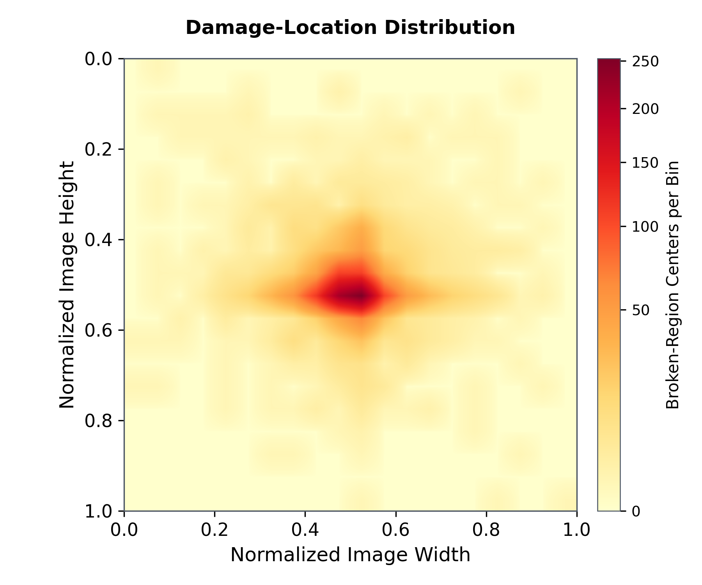

# Damage-Location Distribution

该图统计当前正式 Train、Val、Test 中每个破损玻璃 GT bounding box 的归一化中心点 `(x_center, y_center)`。坐标原点位于图片左上角：横轴 0→1 表示从左到右，纵轴 0→1 表示从上到下。

共统计 2,118 个 GT 框，使用 20×20 个等宽网格，每格覆盖归一化宽高 0.05×0.05。颜色越深表示该位置区间内的破损框中心越多。图片显示采用 bilinear 插值和 `PowerNorm(gamma=0.5)`，使低密度位置仍然可见；色条仍对应真实每格数量，CSV 和 JSON 保存的是插值与色阶变换前的精确网格计数。

| Split | 图片数 | GT 框 |
|---|---:|---:|
| Train | 1,832 | 1,462 |
| Val | 503 | 422 |
| Test | 1,598 | 234 |
| 合计 | 3,933 | 2,118 |

全部中心点的均值为 `(0.499635, 0.492942)`，median 为 `(0.500391, 0.500347)`。最高密度网格为 `x=0.50–0.55、y=0.50–0.55`，包含 253 个 GT 框，说明当前数据的框中心明显集中在图像中央附近。图中的水平和垂直高密度带来自大量中心坐标接近 0.5 的真实标签，并非绘图伪影。

这里展示的是**破损框中心位置分布**，不是框覆盖面积热力图，也不是像素级破损 mask。画布为 6×5 inches、300 DPI，与其他两张数据集分布图高度和 PNG 输出尺寸一致。

下载：[PNG](assets/dataset_statistics/damage_location_distribution.png) · [SVG](assets/dataset_statistics/damage_location_distribution.svg) · [PDF](assets/dataset_statistics/damage_location_distribution.pdf) · [精确分箱 CSV](assets/dataset_statistics/damage_location_distribution.csv) · [统计 JSON](assets/dataset_statistics/damage_location_distribution.json)。可复现脚本：[plot_damage_location_distribution.py](../experiments/plot_damage_location_distribution.py)。
