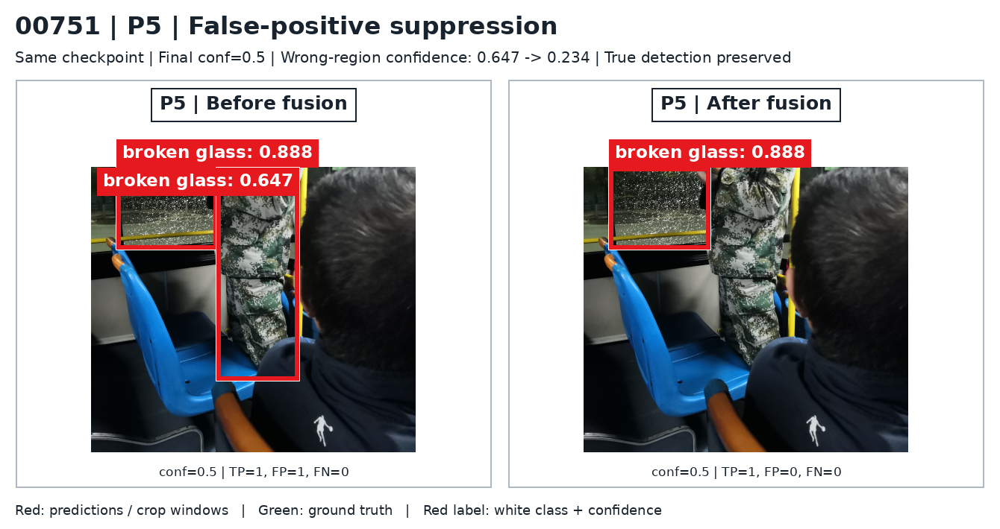

# 当前单头：真实误检置信度压低到 0.5 以下的可视化

2026-09-16，使用[本轮已完成 50 epoch 的 P3/P4/P5](DIRECT_INPUT64_HEADS_TEST_RESULTS_20260916.md)各自 Val best.pt，对每个头扫描完整 1,598 张 Test 图片。**找到一个非破损位置误检被抑制、且保留正确检测的例子：00751 / P5。**

这是固定模型的定性可视化筛选，不用于挑权重或超参数。使用单头训练时保存、SHA256 完全匹配的本地运行源码；没有修改正在运行的多头训练、CAM target、融合逻辑、阈值或权重。

## 00751 / P5：迷彩衣服被误当成破损玻璃

[高清无损 PNG](assets/direct_input64_fp_suppression_20260916_r1/00751/p5/false_positive_suppression.png) · [完整流程 PNG](assets/direct_input64_fp_suppression_20260916_r1/00751/p5/paper_overview.png) · [真实 CAM](assets/direct_input64_fp_suppression_20260916_r1/00751/p5/actual_cam_overlay.jpg) · [实际误检区域 Detail 截图](assets/direct_input64_fp_suppression_20260916_r1/00751/p5/false_positive_detail_crops.jpg) · [全部真实 64×64 截图](assets/direct_input64_fp_suppression_20260916_r1/00751/p5/detail_crops_64/) · [全部 conf>0.2 候选框](assets/direct_input64_fp_suppression_20260916_r1/00751/p5/all_candidates_conf_gt02.jpg)

原图内容为**车厢内部**，不是外拍建筑窗户。正确目标为左上方破损玻璃；错误位置框主要覆盖人的迷彩衣服，与破损玻璃标注框最大 IoU 仅 0.0167，不是同一块玻璃的重复框。

| 检查项 | 融合前全局分支 | 融合后 |
|---|---:|---:|
| 迷彩衣服错误位置框：同一个原始 anchor 置信度 | 0.6467725 | 0.2335875 |
| 正确玻璃框置信度 | 0.8879011 | 0.8879011 |
| TP / FP / FN，IoU≥0.5 匹配 | 1 / 1 / 0 | 1 / 0 / 0 |
| 最终 conf=0.5 下的框数 | 2 | 1 |

## 为什么不是 NMS 去框造成的假象

比较实际模型原始 decoded 输出：原错误框对应 anchor 编号为 8159，融合后该 anchor 的 score 为 0.2335875。所有与原错误框 IoU≥0.5 的原始候选 anchor，融合后最高 score 也只有 0.2335875。因此这一位置在最终 conf=0.5 时确实不能进入检测结果，不只是被另一个高置信度重叠框经 NMS 挤掉。

回归分支与全部 raw decoded 框坐标保持一致；正确玻璃框仍为 0.8879011，且被保留。P5 CAM 非零、所有数值有限：归一化最大值约 1.0，非零比例约 10.03%，raw 最大值约 0.0213153。这里的最强热点位于迷彩衣服区域；它可用于解释实际截图流程，**不能描述成 CAM 只关注正确玻璃**。Detail 实际处理的该误检区域原生 64×64 PNG 一并保存。

先完成完整 Test 筛查，再在独立进程重新导出此图，融合前后每个框的坐标和置信度均与筛查结果匹配。证据见 [误检逐框核验 JSON](assets/direct_input64_fp_suppression_20260916_r1/00751/p5/false_positive_audit.json)、[原始导出 metadata](assets/direct_input64_fp_suppression_20260916_r1/00751/p5/metadata.json)。

## 完整扫描范围与未采用例子

| 已完成单头 | 扫描 Test 图片 | 融合前存在 FP 的图片 | 融合前 FP 框 | 原 FP 置信度 / 区域最高分均跌破 0.5 | 非破损位置 + 正确检测保留的严格正例 |
|---|---:|---:|---:|---:|---:|
| P3 | 1598 | 9 | 10 | 0 | 0 |
| P4 | 1598 | 10 | 11 | 0 | 0 |
| P5 | 1598 | 13 | 15 | 2 | 1 |

FP 按与标注 IoU≥0.5 的一对一贪心匹配判定，因此也包括定位不足或重复框；严格“非破损位置”正例另外要求原错误框与任意标注最大 IoU<0.1，并保留融合前已正确匹配的全部 GT。

02012 / P5 的部分 FP 也跌破 0.5，但该图同时丢掉了正确玻璃检测，且原 FP 主要是定位问题，**不作为改善正例**。00735 / P5 某个 anchor 虽从 0.918 降至 0.298，同一位置仍存在约 0.600 的原始候选，不能说该错误位置已经消失。P3/P4 在本轮扫描中没有找到符合上述要求的误检抑制例子。

筛查对所有图片执行相同的全局分支；仅原本存在 FP 的 32 组“图片×头”再运行真实 CAM/Detail。因此这里**不是一次完整融合模型指标复测，也不统计此前没有 FP 的图片是否新产生 FP**。整体 Test 指标仍以[正式报告](DIRECT_INPUT64_HEADS_TEST_RESULTS_20260916.md)为准，不能将这张正例外推为所有误检都会被修正。

完整筛查证据：[JSON](results/direct_input64_fp_suppression_search_20260916.json)。固定设置：FP32、imgsz=640、实际 rectangular letterbox、batch=1、candidate>0.2、最终 conf=0.5、NMS IoU=0.5、无 alpha、重叠 sum。三个单头依次扫描，92.59 秒；这是筛查耗时，不是 inference benchmark。

**融合前来自同一联合 checkpoint 的第一次全局 forward，不是独立训练的 YOLO/318.pt 基线。**该正例证明固定 checkpoint 内的实际融合步骤抑制了一处错误位置，不单独证明相对独立 YOLO 的整体性能优势。此处展示 P5 单头，不是正在训练的 P3+P4+P5 多头。

素材：[00751 全部三个单头](assets/direct_input64_fp_suppression_20260916_r1/README.md) · [00039 / 00586 / 00601 / 01979 清晰版](assets/direct_input64_head_visuals_20260916_pretty/README.md)。图片标签均为粗红框、贴框的 `broken glass: confidence` 红底白字；零值 CAM 保持原样。
