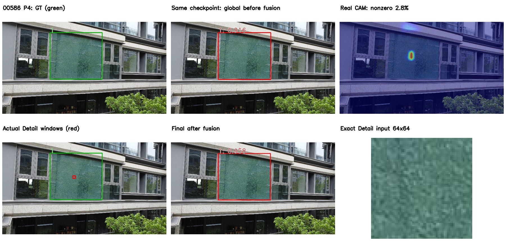
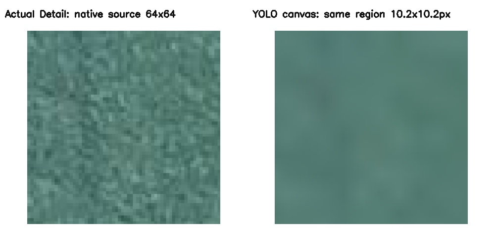

# 当前 P3 / P4 / P5 单头：真实 Grad-CAM、Detail 截图与检测可视化

生成：2026-09-16。使用[本轮完成 50 epoch 的三个独立单头](DIRECT_INPUT64_HEADS_TEST_RESULTS_20260916.md)各自 Val best.pt，**不是旧权重，也不是 P3+P4+P5 多头**。

素材目录：[assets/direct_input64_head_visuals_20260916_r1](assets/direct_input64_head_visuals_20260916_r1/)。GitHub 发布位置为 **main 分支的 docs**，包括全部 JPG / PNG 图片、说明 MD 与配套 JSON；原始 NPZ 数组和导出脚本保留在训练机本地，不包含在本次图片上传中。单头指标报告也在 main/docs。

可以直接打开[图片目录的预览首页](assets/direct_input64_head_visuals_20260916_r1/README.md)，无需切换到实验分支。

## 用户选定的 00601 / 01979：清晰排版版

新增[两张图片的清晰版预览首页](assets/direct_input64_head_visuals_20260916_pretty/README.md)。红框更粗，检测标签使用常见的 `broken glass: 0.979` 红底白字样式，紧贴红框上边缘；顶部流程标题保持白底深色字。检测 / 截图区域内部不填色，保留真实纹理和 CAM。先缩放图片再绘制固定字号标记，同时提供无损 PNG。

- 00601：[三个单头比较 JPG](assets/direct_input64_head_visuals_20260916_pretty/00601/comparison.jpg) / [PNG](assets/direct_input64_head_visuals_20260916_pretty/00601/comparison.png)；[P4 完整流程 PNG](assets/direct_input64_head_visuals_20260916_pretty/00601/p4/paper_overview.png)，有效 CAM，置信度 0.933→0.979。
- 01979：[三个单头比较 JPG](assets/direct_input64_head_visuals_20260916_pretty/01979/comparison.jpg) / [PNG](assets/direct_input64_head_visuals_20260916_pretty/01979/comparison.png)；[P5 完整流程 PNG](assets/direct_input64_head_visuals_20260916_pretty/01979/p5/paper_overview.png)，有效 CAM，置信度实际为 0.995→0.958。

这次只是重绘样式，未重新推理或调整方法。六组 metadata 与全部 73 张真实 64×64 截图和旧版逐字节一致，CAM 数值不变，零值仍明确标注。两张图片的 TP/FP/FN 均未改善，不能将美化当作性能提升。最初 r1 目录保留不变；清晰版白底检测标签样式保留在 GitHub 历史提交 e8319e7。

## 看哪些图片

每张横向比较图：行依次为 P3、P4、P5；列依次为融合前全局分支、实际 Grad-CAM、原图上的 Detail 截图位置、最终检测。红色为预测框 / Detail 窗口，绿色为标注框。

| Test 图片 | 内容 | P3 CAM | P4 CAM | P5 CAM | 三个单头比较 |
|---|---|---|---|---|---|
| 00586 | 外拍建筑玻璃，适合框架图；P4/P5 热点位于破损玻璃 | 有值，但最强点在标注外 | 有值，最强点在标注内 | 有值，最强点在标注内 | [比较图](assets/direct_input64_head_visuals_20260916_r1/00586/comparison.jpg) |
| 00587 | 外拍窗户，检查弱响应与零值 | 极弱 raw 响应；归一化有值，最强点在标注外 | 有值，最强点在标注内 | 全零，框中心回退 | [比较图](assets/direct_input64_head_visuals_20260916_r1/00587/comparison.jpg) |
| 00039 | 外拍远处玻璃幕墙，检查压缩后的小目标 | 有值，最强点在标注内 | 有值，最强点在标注内 | 全零，框中心回退 | [比较图](assets/direct_input64_head_visuals_20260916_r1/00039/comparison.jpg) |
| 00601 | 外拍窗户；P3 有额外错误位置框，融合后仍保留 | 全零，框中心回退 | 有值，最强点在标注内 | 全零，框中心回退 | [比较图](assets/direct_input64_head_visuals_20260916_r1/00601/comparison.jpg) |
| 01979 | 外拍单扇玻璃，展示 P5 的有效热点 | 全零，框中心回退 | 全零，框中心回退 | 有值，最强点在标注内 | [比较图](assets/direct_input64_head_visuals_20260916_r1/01979/comparison.jpg) |
| 00970 | 玻璃顶，多目标 / 漏检对照 | 有值，最强点在标注内 | 有值，最强点在标注内 | 有值，最强点在标注内 | [比较图](assets/direct_input64_head_visuals_20260916_r1/00970/comparison.jpg) |

推荐先看 00586 的 P4 完整流程：

该图正确框置信度约从 0.916 提升至 0.958，但 TP / FP / FN 数量没有变化，不能据此声称消除了误检。P3、P5 的变化也不能默认都是改善。

同一原图区域的纹理对照（左：真实 Detail 64×64 输入；右：从本张图片实际 YOLO 输入画布中采样的同一区域，再放大用于展示）：

右侧不是重新从原图裁剪后缩放，而是读取真实 letterbox 输入的像素；两侧原图范围相同。每组 metadata 的 `texture_comparison` 记录该原图 64×64 区域在 YOLO 输入画布上实际占多少像素。这个对照说明输入采样细节的差异，不直接证明最终检测提升。

## 每组素材的文件

例如 `assets/direct_input64_head_visuals_20260916_r1/00586/p4/`：

- `original.jpg`、`ground_truth.jpg`：原图与绿色标注。
- `all_candidates_conf_gt02.jpg`：原 YOLO 第一次 forward 所有 pre-NMS、score >0.2 的候选框，**不是 NMS 后的框**。
- `global_before_fusion.jpg`、`final_after_fusion.jpg`：融合前 / 后，均最终 conf=0.5、NMS IoU=0.5，粗红框、较大文字。
- `actual_cam_overlay.jpg`：实际运行 CAM 映回原图的热力图；不更改 CAM target / 数值 / ReLU。
- `actual_cam_grayscale.png`：实际输入画布上的灰度 CAM；全零就是黑图。
- `actual_cam_arrays.npz`（仅训练机本地）：原始 float32 CAM，包含 actual-input 和映射至原图两种坐标；未上传 GitHub。
- `actual_detail_source_windows.jpg`：Detail 实际截图范围，在原图中画红框。
- `detail_crops_64/Cxxx.png`：**全部**实际 64×64 原图截图，不只保留第一张。
- `detail_crops_montage.jpg`：不同截图位置的放大预览；相同位置只显示一次，全部输入仍单独保存。
- `detail_vs_global_same_region.jpg`：第一张真实 Detail 截图与实际压缩 YOLO 输入同一区域的纹理对照。
- `actual_detail_inputs.npz`（仅训练机本地）：真实 ImageNet-normalized RGB 输入 tensor；反查原图截图后最大差值 ≤1e-5；未上传 GitHub。
- `metadata.json`：实际矩阵、候选框、截图 xyxy、CAM 数值、前后检测及 TP/FP/FN（IoU≥0.5 贪心匹配）。
- `paper_overview.jpg`：标注 / 融合前 / CAM / 实际截图位置 / 最终结果 / 第一张 Detail 输入六联图。

目录根部 `results.json` 汇总 18 组结果与实际权重 SHA256。JPEG 为方便浏览缩小至最长边 1600；64×64 PNG 不缩小，坐标和浮点数据仍为原始坐标 / 数值。不能根据缩小后的 JPEG 尺寸解释 metadata 坐标。

## 方法与结论边界

FP32、imgsz=640、rectangular letterbox、candidate >0.2，与本轮 standalone Test 相同；YOLO Conv–BN 部署 fuse。P3/P4/P5 hook 都在 Detect 的 `cv3[level][1]`。保留 all-original-sigmoid-score sum target，按实际 H/W 放大，不交换 x/y。热力图逆变换采用本张图片实际整数 padding / resize 矩阵，并在 OpenCV 中转换为像素中心坐标。

Detail 的原生输出均为 3×4×4。回填前按固定 64 输入像素支持调整为 P3=8×8、P4=4×4、P5=2×2，与当前训练逻辑一致；没有 alpha，重叠 sum。截图选择范围仍是候选框内部；CAM 全零 / 框内没有有效响应 / 框过小时采用有效框中心回退，不能将该截图称为“由有效热点引导”。

**融合前是同一联合训练 checkpoint 的原 YOLO 第一次 forward，不是独立训练的 318.pt 或 standalone YOLO 基线。**三个单头的 YOLO 权重已经各自联合训练，因此不同单头的 before panel 也不是同一套权重。

本批 CAM：P3 4/6 有值、P4 5/6 有值、P5 3/6 有值；共 6/18 全零，所有测得值有限。00587 的 P3 raw 最大值仅约 1.67e-9，虽按原归一化公式产生可见热点，也不代表稳定、强烈的正响应。这六张是定向选择的可视化例子，**不能外推为完整 Test 的零值率**。

六张的融合前后 TP/FP/FN 均未改变。00601 的 P3 对非破损位置的误检未被修正；00970 的第二块玻璃仍漏检，已如实保留。00586 可用于结构和纹理截图展示，但若论文需要“融合消除误检 / 补回漏检”的正例，必须另行筛选并核验，不能用这批结果代替。

本地导出脚本：`experiments/export_input64_head_visuals.py`。仅执行只读推理，没有 optimizer step，没有覆盖权重，也没有修改训练代码来改变这批热力图。
