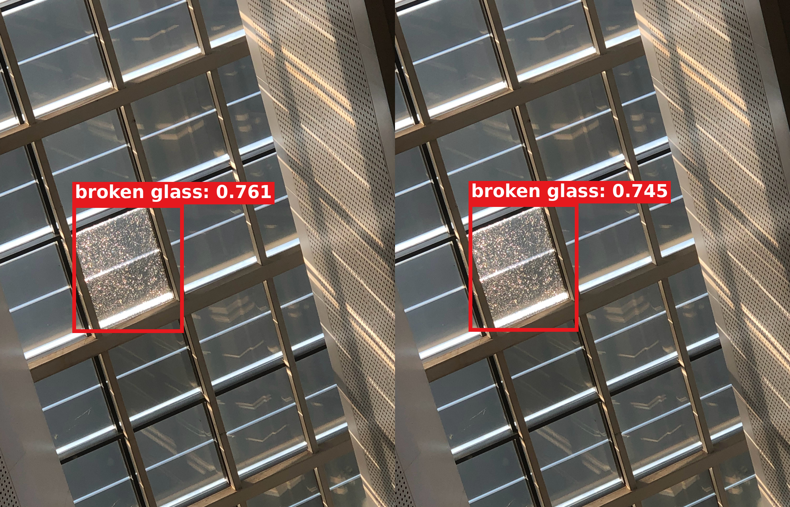
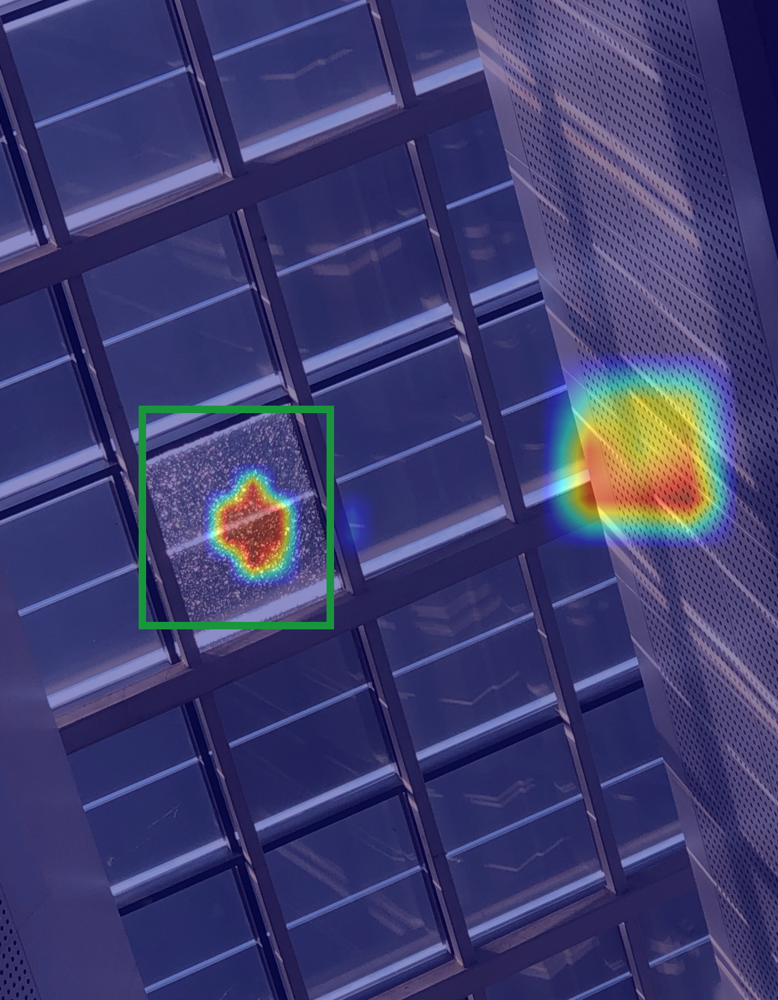
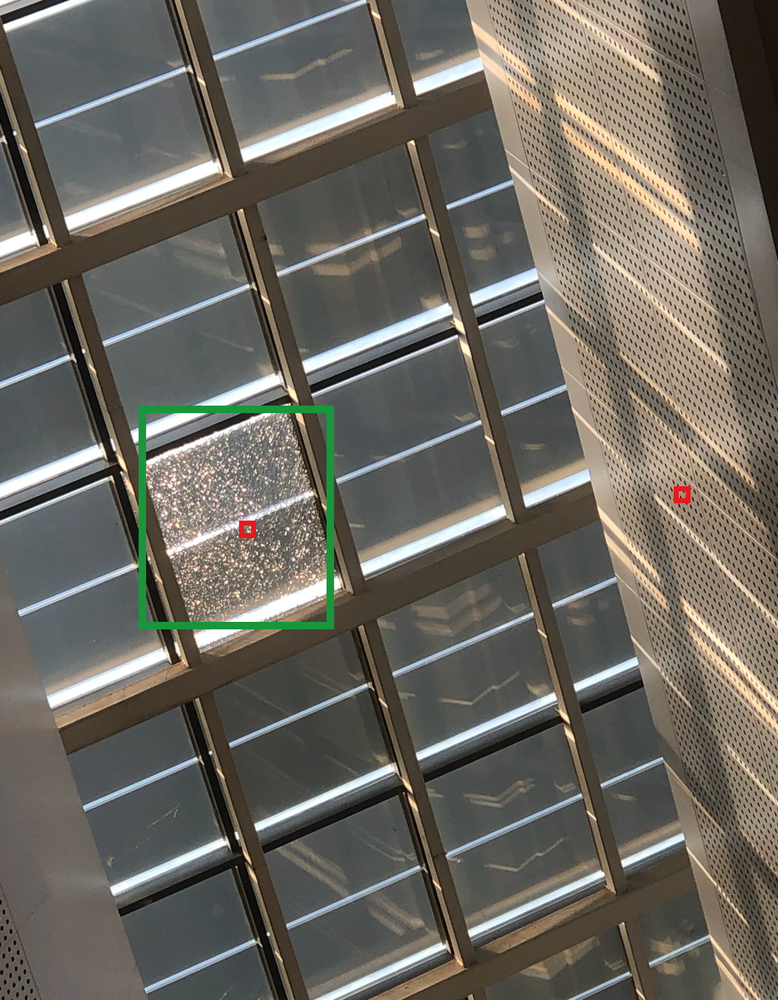

# Val 00657：P3+P4+P5 三头可视化

使用当前三头 r2 的 Val-best checkpoint 对 Val `00657.jpg` 做只读推理。模型使用 P3、P4、P5 三个分支，三个融合投影相互独立，稀疏支持大小分别为 8×8、4×4、2×2，融合方式为 `sum`，没有 alpha 参数。候选阈值为 0.2，最终显示阈值与 NMS IoU 均为 0.5。

## 融合前后检测

该图有 1 个 GT。融合前检测置信度为 0.760790，融合后为 0.745248；两侧 TP / FP / FN 均为 1 / 0 / 0。因此本例用于展示三头工作过程与定位情况，不能描述为置信度或检测指标提高。这里的“融合前”是同一个联合 checkpoint 的 global pass，不是另一个独立训练的 YOLO baseline。

## 三头聚合 Grad-CAM

聚合 CAM 最大值约为 1.0，非零比例为 6.092%。峰值原图坐标为 `(978, 2083)`，位于 GT 破损玻璃框内；GT 框内的 CAM 能量比例为 24.38%。热图正确响应了破损玻璃，同时在右侧穿孔墙面存在另一块较强响应。发布图保留了这一现象，没有裁剪、重绘或修改 CAM。

| 分支 | CAM max | 非零比例 |
|---|---:|---:|
| P3 | 0.000000 | 0.000% |
| P4 | 0.997861 | 1.611% |
| P5 | 0.993488 | 4.482% |

P3 在这个样本上的 CAM 经 ReLU 后为零，聚合有效响应来自 P4 与 P5；这不表示 P3 分支从模型中删除。

## 候选框和 Detail Model 输入

共有 10 个 `conf>0.2` 候选并执行了 10 次 Detail 输入记录，对应两个唯一的原图 64×64 区域：

- `[929,2022,993,2086]`：中心位于 GT 内，对应 8 个候选记录；
- `[2619,1888,2683,1952]`：中心位于 GT 外，对应 2 个低置信候选记录。

右侧非目标大框的 global candidate 置信度为 0.204 和 0.303，低于最终阈值 0.5，因此融合前后最终检测结果中都没有形成 FP。

[全部候选框](assets/direct_input64_multi_00657_val_20260916/00657/multi/all_candidates_conf_gt02.jpg) · [最终检测](assets/direct_input64_multi_00657_val_20260916/00657/multi/final_after_fusion.jpg) · [全部真实 64×64 Detail 截图](assets/direct_input64_multi_00657_val_20260916/00657/multi/detail_crops_64/) · [Detail 截图拼图](assets/direct_input64_multi_00657_val_20260916/00657/multi/detail_crops_montage.png) · [Detail 与全局同区域纹理对比](assets/direct_input64_multi_00657_val_20260916/00657/multi/detail_vs_global_same_region.png) · [完整六联流程](assets/direct_input64_multi_00657_val_20260916/00657/multi/paper_overview.png) · [逐项 metadata](assets/direct_input64_multi_00657_val_20260916/00657/multi/metadata.json)

所有发布图片均无外部白边、标题、图例和拼图间隔；预测使用粗红框与贴框的红底白字 `broken glass: confidence`。可视化没有修改检测坐标、置信度或 CAM 数值。权重 SHA256 为 `aec33ba87c3f534740a4501b6a545fcf9d7e2c27f080207b7613e7b4b06bb2c0`。
