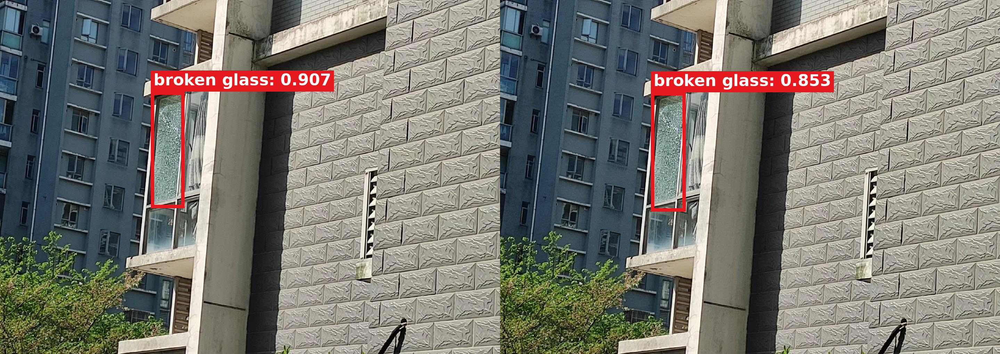
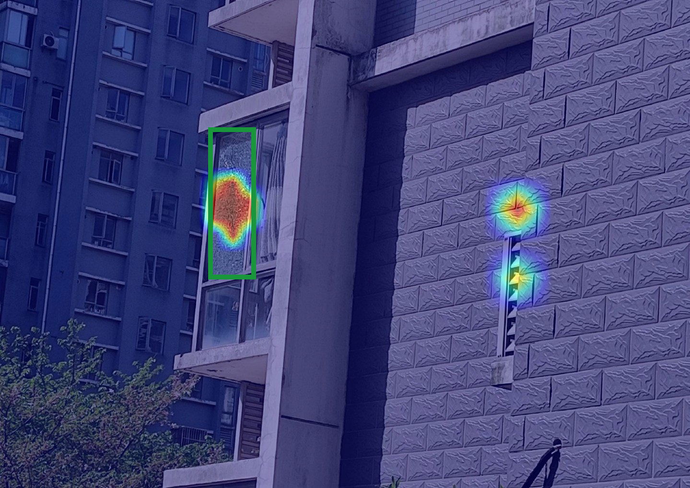
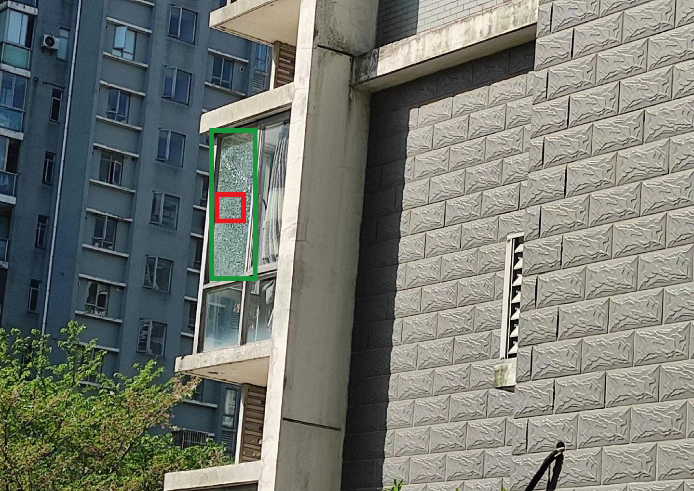

# Test 00756：P3+P4+P5 三头可视化

使用当前三头 r2 的 Val-best checkpoint 对 Test `00756.jpg` 做只读推理。模型同时使用 P3、P4、P5，三个融合投影相互独立，稀疏支持大小分别为 8×8、4×4、2×2，融合方式为 `sum`，没有 alpha 参数。候选阈值为 0.2，最终显示阈值与 NMS IoU 均为 0.5。

## 融合前后检测

该图有 1 个 GT。融合前检测置信度为 0.907183，融合后为 0.853419；两侧 TP / FP / FN 都是 1 / 0 / 0。因此本例用于展示三头运行过程与定位情况，不应描述为置信度或检测指标提高。

## 聚合 Grad-CAM

聚合 CAM 最大值为 1.0，非零比例为 3.968%。最大响应点为原图坐标 `(484, 454)`，位于 GT 框内；CAM 能量位于 GT 框内的比例为 49.31%。热图在破损玻璃区域有明显响应，但右侧墙面通风口附近也存在响应，论文中应如实保留，不能裁掉或重绘。

| 分支 | CAM max | 非零比例 |
|---|---:|---:|
| P3 | 0.000000 | 0.000% |
| P4 | 0.998614 | 1.429% |
| P5 | 0.968446 | 2.540% |

P3 在这张图上的 CAM 为零，聚合有效响应来自 P4 与 P5。这不代表 P3 分支被删除，只表示该样本、该目标下 P3 的 Grad-CAM 经 ReLU 后为零。

## Detail Model 输入位置与真实截图

共有 9 个 `conf>0.2` 候选，它们选中了同一个原图 64×64 区域 `[445,399,509,463]`，因此是 9 次候选记录、1 个唯一截图区域。对应区域投影到 YOLO 输入画布约为 28.46×28.49 像素。

[全部候选框](assets/direct_input64_multi_00756_20260916/00756/multi/all_candidates_conf_gt02.jpg) · [最终检测](assets/direct_input64_multi_00756_20260916/00756/multi/final_after_fusion.jpg) · [真实 64×64 Detail 截图](assets/direct_input64_multi_00756_20260916/00756/multi/detail_crops_64/) · [Detail 与全局同区域纹理对比](assets/direct_input64_multi_00756_20260916/00756/multi/detail_vs_global_same_region.png) · [完整六联流程](assets/direct_input64_multi_00756_20260916/00756/multi/paper_overview.png) · [逐项 metadata](assets/direct_input64_multi_00756_20260916/00756/multi/metadata.json)

所有发布图片均为原生图像边界，没有外部白边、标题、图例或拼图间隔；预测使用粗红框和贴框的红底白字 `broken glass: confidence`。可视化没有修改检测坐标、置信度或 CAM 数值。权重 SHA256 为 `aec33ba87c3f534740a4501b6a545fcf9d7e2c27f080207b7613e7b4b06bb2c0`。
