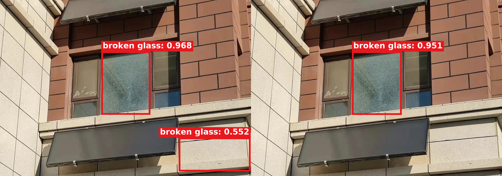
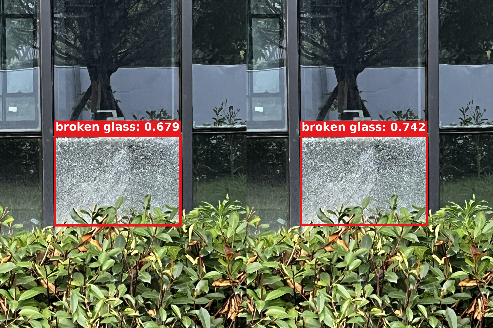

# 三头 r2：误检消除与正确目标置信度提高可视化

使用当前 P3+P4+P5 三头 r2 的 Val-best checkpoint，对完整 1,598 张 Test 逐图检查同一 checkpoint 的全局 pass 与融合 pass。筛选不改阈值、不改 NMS、不改图片、不重算或美化 CAM；图片没有外部标题、白边、图例或拼图间隔，框内区域不填充，预测框为粗红框、红底白字 `broken glass: confidence`。

## 00601：非破损外墙误检被消除

左侧全局 pass 有一个正确破损玻璃框 0.968，另把建筑右下方非玻璃外墙误检为 0.552；融合后正确框保留为 0.951，错误框消失。逐 decoded anchor 检查为：原错误 anchor 0.551983→0.392407，与旧错误框 IoU≥0.5 的全部区域 anchor 最高仅 0.395990，融合后最终框与旧错误框的最大 IoU<0.5。因此这是分类置信度确实跌破 0.5，不是 NMS 换框造成的假象。TP/FP/FN 为 1/1/0→1/0/0。

[无损前后对比](assets/direct_input64_multi_improvements_20260916_r2/00601/multi/before_after_comparison.png) · [真实聚合 CAM](assets/direct_input64_multi_improvements_20260916_r2/00601/multi/actual_cam_overlay.jpg) · [Detail 截图位置](assets/direct_input64_multi_improvements_20260916_r2/00601/multi/actual_detail_source_windows.jpg) · [错误区域实际 64×64 截图](assets/direct_input64_multi_improvements_20260916_r2/00601/multi/false_positive_detail_crops.png) · [全部 conf>0.2 候选框](assets/direct_input64_multi_improvements_20260916_r2/00601/multi/all_candidates_conf_gt02.jpg) · [完整六联流程](assets/direct_input64_multi_improvements_20260916_r2/00601/multi/paper_overview.png) · [逐框 JSON](assets/direct_input64_multi_improvements_20260916_r2/00601/multi/false_positive_audit.json)

这张图尤其适合与旧单头结果对照：此前 00601/P3 的错误框 0.558 没有被修正，不能算单头改善；当前三头 r2 则在相同图片上通过严格条件消除了该错误位置框。两者是不同 checkpoint，不把跨模型差异描述成同一次 forward 内的变化。

## 00890：正确破损玻璃置信度提高

同一正确目标在全局 pass 为 0.679421，三头融合后为 0.741571，提高 0.062150；两边 TP/FP/FN 都是 1/0/0。这里称为“正确目标置信度提高”，不把单张图分数变化写成 mAP 提高。

[无损前后对比](assets/direct_input64_multi_improvements_20260916_r2/00890/multi/before_after_comparison.png) · [真实聚合 CAM](assets/direct_input64_multi_improvements_20260916_r2/00890/multi/actual_cam_overlay.jpg) · [Detail 截图位置](assets/direct_input64_multi_improvements_20260916_r2/00890/multi/actual_detail_source_windows.jpg) · [全部真实 64×64 截图](assets/direct_input64_multi_improvements_20260916_r2/00890/multi/detail_crops_64/) · [全部 conf>0.2 候选框](assets/direct_input64_multi_improvements_20260916_r2/00890/multi/all_candidates_conf_gt02.jpg) · [完整六联流程](assets/direct_input64_multi_improvements_20260916_r2/00890/multi/paper_overview.png) · [metadata](assets/direct_input64_multi_improvements_20260916_r2/00890/multi/metadata.json)

## 完整筛选结果与诚实边界

| 项目 | 全局 pass | 融合 pass |
|---|---:|---:|
| conf=0.5 汇总 TP | 213 | 212 |
| 汇总 FP | 11 | 12 |
| 汇总 FN | 21 | 22 |

完整 Test 中找到 1 个严格错误位置误检消除案例（00601），没有找到“GT 区域 decoded 分数从 <0.5 严格跨到 ≥0.5、同时不增加 FP”的漏检补回案例；另外找到 00890 的显著正确目标置信度提高。按逐图 FP+FN 计，1 张改善、1,595 张不变、2 张变差。因此不能从两张正例推导三头融合普遍改善，也不能用该工作点计数替代正式 COCO-style AP。正式 r2 Test mAP50–95 为 0.888222115，见[当前单头与三头总表](DIRECT_INPUT64_CURRENT_SINGLE_MULTI_RESULTS_20260916.md)。

原始逐图筛选结果为 [JSON](results/direct_input64_multi_improvement_search_20260916.json)。`fusion before` 是同一 joint checkpoint 的全局 pass，不是独立训练的 YOLO baseline；本次图像只是训练结束后的定性选图，没有参与 checkpoint / epoch / 超参数选择。

此前单头已核验改善案例继续保留：[Test 00751 / P5](DIRECT_INPUT64_FP_SUPPRESSION_SEARCH_20260916.md)；[Val 00770 / 00657 / 02211 / P5](DIRECT_INPUT64_VAL_FP_SUPPRESSION_20260916.md)。论文中应将 Test 与 Val 分开标注，不能混成同一个测试集合。
