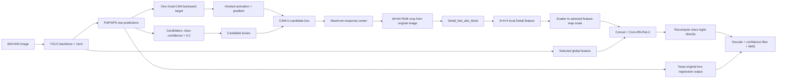

# Direct 单头与多头 Grad-CAM–Detail 融合：论文方法与实验说明

更新日期：2026-09-04

> **更正说明（2026-09-14）：** P3/P4/P5 单头 Direct 已完成 scatter 原地写入、`[x,y]`
> 到 BCHW `[y,x]` 坐标映射及尺度自适应修正。论文中的单头尺度消融请以
> [`CORRECTED_SINGLE_HEAD_SUM_RESULTS.md`](CORRECTED_SINGLE_HEAD_SUM_RESULTS.md) 为准；本页旧单头
> 数字仅保留作历史记录。

本文档集中整理当前项目中**不使用 alpha**的 Direct 融合方法，包括 Detect 内部单头 Direct、
P3–P5 多头 Direct，以及 Detect 前 P4 C2f Direct 扩展。内容依据当前实现、checkpoint、训练
CSV 和复测日志整理，可作为论文方法、实验设置、消融实验和实现细节的基础材料。

## 1. 方法范围与术语

| 名称 | Hook / 融合位置 | 修改的检测尺度 | Alpha | 状态 |
|---|---|---|---|---|
| Detect-internal Single-head Direct | `Detect.cv3[l][1]` | 一个尺度 | 无 | P3、P4 已训练 |
| P3–P5 Multi-head Direct | 三个 `Detect.cv3[l][1]` | P3、P4、P5 | 无 | 完整复跑，论文主模型 |
| Pre-Detect P4 Direct | Neck 第 18 层 P4 C2f | P4 | 无 | 已训练和 test |

本文所称 **Direct** 表示融合分类 logit 直接替换原分类 logit：

\[
z_{cls}^{\prime(l)}=g_{cls}^{(l)}(F_{fuse}^{(l)}),
\]

不使用固定 alpha，也不使用可学习 alpha，不执行
`base + alpha * (fused - base)`。

代码中的尺度命名映射为：

```text
high -> index 0 -> P3 -> stride 8  -> 80×80
mid  -> index 1 -> P4 -> stride 16 -> 40×40
low  -> index 2 -> P5 -> stride 32 -> 20×20
```

输入尺寸均以 `640×640` 为例。

## 2. 总体数据流



方法不修改 YOLO 的 DFL/bounding-box regression 分支。Detail 只通过融合特征重算分类 logits，
因此它主要改变候选位置被接受为破损玻璃的置信度，而不直接预测新的框坐标。

## 3. Candidate 生成

YOLO 第一次 forward 后得到解码预测和 P3/P4/P5 raw head tensors。当前任务只有一个类别
`Broken glass`，内部候选集合定义为：

\[
\mathcal C=\{i\mid p_i>0.2\}.
\]

实现细节：

- `candidate_conf=0.2` 只控制哪些 raw predictions 进入 Grad-CAM/Detail 路径；
- 候选进入 Detail 前不执行常规最终 NMS；
- 正式 val/test 使用独立的最终阈值 `conf=0.5`；
- 正式 val/test 的 NMS IoU 为 `0.5`；
- 候选框来自 YOLO 预测，不由 GT 注入；
- GT 只用于训练监督和评估，不参与推理阶段的候选生成。

## 4. Grad-CAM 定位

### 4.1 目标与反向传播

CAM target 由 raw anchors 的类别概率构成。一次 target backward 得到所选层的 activation
\(A^{(l)}\) 和 gradient。对第 \(l\) 个尺度：

\[
\alpha_k^{(l)}=\frac{1}{H_lW_l}\sum_{u,v}
\frac{\partial T}{\partial A_{k,u,v}^{(l)}},
\qquad
M^{(l)}=\operatorname{ReLU}\left(\sum_k\alpha_k^{(l)}A_k^{(l)}\right).
\]

单头方法只使用一个 CAM；多头方法在**同一次 backward** 中取得 P3、P4、P5 三组梯度，分别
resize 和归一化后取均值：

\[
M=\operatorname{Normalize}\left(\frac{1}{3}\sum_{l\in\{P3,P4,P5\}}
\operatorname{Normalize}(\operatorname{Resize}(M^{(l)}))\right).
\]

### 4.2 CAM 引导裁剪

对每个 candidate box，在框内寻找固定窗口的最大 CAM 响应并取其中心；搜索失败时回退到候选框
中心。中心映射回原图后裁剪 `64×64` RGB patch，并使用 ImageNet mean/std 归一化。

中心搜索、磁盘读取和离散 crop 不可微，训练梯度不会穿过这些操作。梯度可以更新 YOLO、Detail
和融合层，但不能对 crop 中心本身求导。

## 5. Detail 模块

使用独立预训练的 `Detail_Net_attn_block`：

```text
Input candidate crop: 3×64×64
        |
      2×2 MaxPool
        |
  +-----+------+----------------+
  |            |                |
Large route  Medium route    Small route
  |            |                |
128×4×4      64×4×4          64×4×4
  |            |                |
Dilated      Dilated          Dilated
attention    attention        attention
  |            |                |
1×1 Conv     1×1 Conv         1×1 Conv
128->1       64->1            64->1
  +------------+----------------+
               |
             Concat
               |
          BN + ReLU
               |
       Detail feature: 3×4×4
```

三条分支均使用 residual main/shortcut 结构。注意力模块包含四条并行 `3×3` 卷积，dilation 分别为
`1, 3, 5, 7`；四路特征 concat 后经 `1×1 Conv + Sigmoid` 形成空间/通道调制权重，再与输入逐元素
相乘。

预训练权重：

```text
run/detail_net_attn.pt
SHA-256: 7d6c2af44137c1eb8169bf282d702cfc78d3090b9ebbb75c1cd6b3714e84556e
```

## 6. Detail feature scatter

每个候选框产生一个 `3×4×4` Detail feature。根据 Grad-CAM 中心，将其写入目标尺度的三通道
稀疏特征图：

```text
P3 scatter map: B×3×80×80
P4 scatter map: B×3×40×40
P5 scatter map: B×3×20×20
```

同一位置收到多个候选特征时采用加法累积。该 sparse map 与对应的 YOLO 全局特征按通道 concat。

## 7. Detect 内部单头 Direct

### 7.1 Hook 与张量尺寸

选择一个分类尺度 \(l\)：

```text
P3: Detect.cv3[0][1] -> B×64×80×80
P4: Detect.cv3[1][1] -> B×64×40×40
P5: Detect.cv3[2][1] -> B×64×20×20
```

单头融合为：

\[
F_{fuse}^{(l)}=\operatorname{ReLU}\left(
\operatorname{BN}^{(l)}\left(
\operatorname{Conv}_{3\times3}^{(l)}([A^{(l)};S^{(l)}])
\right)\right),
\]

张量变化：

```text
Hooked Detect feature: B×64×H×W
Detail scatter map:    B× 3×H×W
Concat:                B×67×H×W
Conv-BN-ReLU:          67 -> 64
Final classifier:      Detect.cv3[l][2], 64 -> nc
Direct replacement:    x[l][:, class_channels] = fused logits
```

每个融合投影包含 `38,784` 个参数。单头总参数量为 `4,209,276`。

### 7.2 已完成单头实验

| 实验 | 训练期最高 val mAP50-95 | 重新加载 best.pt 的 val | test mAP50-95 | test latency |
|---|---:|---:|---:|---:|
| P3 Detect-internal Direct | 0.92072 | 约 0.916 | **0.882735** | 53.11 ms/image |
| P4 Detect-internal Direct | 0.91809 | 约 0.918 | 未做统一 test | 未报告 |

P5 Detect-internal 单头、无 alpha、50 epoch Direct 尚未完成，论文不能把 P5 alpha-0.5 的结果写成
P5 Direct 结果。

## 8. P3–P5 多头 Direct

### 8.1 共享部分

多头不是复制三套 YOLO 或运行三次 Detail。以下计算只执行一次：

- YOLO backbone/neck forward；
- raw candidate 生成；
- Grad-CAM target backward；
- 候选中心定位与 64×64 crop；
- Detail encoder forward。

一次 backward 同时捕获三层 activation/gradient，Detail 输出复用于三个尺度。

### 8.2 独立部分

同一个 `3×4×4` Detail feature 分别 scatter 到 P3/P4/P5。每个尺度使用独立的融合投影：

```text
P3: [64+3, 80,80] -> Conv3×3(67,64) -> BN -> ReLU -> cv3[0][2]
P4: [64+3, 40,40] -> Conv3×3(67,64) -> BN -> ReLU -> cv3[1][2]
P5: [64+3, 20,20] -> Conv3×3(67,64) -> BN -> ReLU -> cv3[2][2]
```

三个投影不共享参数：

```python
conv_for_yolo_multi[0]  # P3
conv_for_yolo_multi[1]  # P4
conv_for_yolo_multi[2]  # P5
```

三个尺度的 class logits 均被直接替换；三个尺度的 box-regression channels 全部保持原 YOLO 输出。

### 8.3 参数量

| 模块 | 参数量 |
|---|---:|
| Pure YOLO | 3,011,043 |
| Detail encoder | 1,159,449 |
| 三个独立 67→64 融合投影 | 116,352 |
| **Multi-head Direct total** | **4,286,844** |

相对纯 YOLO 增加 `1,275,801` 个参数，即约 `42.37%`。

### 8.4 论文主多头结果

论文主多头 checkpoint 使用第二次完整复跑：

```text
experiments/runs/best318_multihead_all_detectconv_direct_e50_lr1e4_rerun2/weights/best.pt
```

训练过程中最高 val（第 21 epoch）：

| Precision | Recall | mAP50 | mAP75 | mAP50-95 |
|---:|---:|---:|---:|---:|
| 0.97776 | 0.93748 | 0.96906 | 0.93823 | **0.91496** |

重新加载 `best.pt` 的 val 复测：

| Precision | Recall | mAP50 | mAP75 | mAP50-95 |
|---:|---:|---:|---:|---:|
| 约 0.972 | 约 0.934 | 约 0.973 | 约 0.936 | **约 0.914** |

统一 test（1598 images、234 instances）：

| Precision | Recall | mAP50 | mAP75 | mAP50-95 | Inference |
|---:|---:|---:|---:|---:|---:|
| 0.959459 | 0.910256 | 0.946014 | 0.914087 | **0.891513** | 53.61 ms/image |

## 9. Detect 前 P4 C2f Direct 扩展

该变体把 hook 从 Detect 分类分支内部前移到直接馈入 Detect 的 P4 Neck 特征。当前 YOLO 图结构为：

```text
Layer 15 C2f -> P3 -> Detect input 0
Layer 18 C2f -> P4 -> Detect input 1
Layer 21 C2f -> P5 -> Detect input 2
Detect.f = [15, 18, 21]
```

P4 第 18 层实际张量为 `B×128×40×40`。融合过程：

```text
P4 C2f global feature: B×128×40×40
P4 Detail scatter map: B×  3×40×40
Concat:                B×131×40×40
Conv3×3 + BN + ReLU:   131 -> 128
Complete P4 cls path:  128 -> 64 -> 64 -> nc
```

融合特征进入完整的 `Detect.cv3[1]` 分类分支；原始 P4 特征继续进入 `Detect.cv2[1]` 框回归分支。
总参数量为 `4,321,788`。

训练期最高 val 与正式 test：

| Checkpoint | 最高 val mAP50-95 | test P | test R | test mAP50 | test mAP75 | test mAP50-95 | Inference |
|---|---:|---:|---:|---:|---:|---:|---:|
| P4 pre-Detect Direct best.pt | 0.91510 | 0.942423 | 0.897436 | 0.941497 | 0.916078 | **0.882149** | 52.41 ms/image |

权重：

```text
experiments/runs/best318_p4_predetect_c2f_direct_e50_lr1e4_r3/weights/best.pt
```

## 10. 统一训练协议

所有本文列出的 50-epoch Direct 联合训练均从两套独立预训练权重构建，而不是从 historical
`best318.pt` 初始化：

```text
YOLO initialization:
yolo-runs/train/train10/weights/best.pt

Detail initialization:
run/detail_net_attn.pt
```

融合投影随机初始化，YOLO、Detail 和融合层全部参与联合微调。

| 参数 | 设置 |
|---|---|
| Dataset config | `experiments/bg_local.yaml` |
| Epochs | 50 |
| Input size | 640×640 |
| Batch size | 32 |
| Optimizer | AdamW |
| Initial LR | 1×10^-4 |
| Final LR factor | 0.01 |
| Momentum | 0.937 |
| Weight decay | 5×10^-4 |
| Warmup epochs | 3.0 |
| Warmup momentum | 0.8 |
| Warmup bias LR | 0.0 |
| AMP | enabled |
| Seed | 0 |
| Deterministic | true |
| Candidate confidence | 0.2 |

Workers 在归档运行之间不同：P3 和 pre-Detect P4 使用 8，P4 Detect-internal 与多头复跑使用 2。
这不改变数学方法，但会影响 wall-clock throughput。

## 11. 统一测试协议与对比

正式 test 协议：

```text
split=test
images=1598
instances=234
imgsz=640
conf=0.5
iou=0.5
batch=1
device=RTX 6000 Ada / CUDA:0
```

| 模型 | P | R | mAP50 | mAP75 | mAP50-95 | inference |
|---|---:|---:|---:|---:|---:|---:|
| Pure YOLO baseline | 0.932735 | 0.888889 | 0.926368 | 0.898112 | 0.870250 | 1.68 ms |
| Historical best318 | 0.954128 | 0.888889 | 0.926514 | 0.901398 | 0.872197 | 54.9 ms |
| P3 Single-head Direct | 0.942222 | 0.905983 | 0.937386 | 0.907642 | 0.882735 | 53.11 ms |
| P4 pre-Detect Direct | 0.942423 | 0.897436 | 0.941497 | 0.916078 | 0.882149 | 52.41 ms |
| **P3–P5 Multi-head Direct rerun2** | **0.959459** | **0.910256** | **0.946014** | **0.914087** | **0.891513** | **53.61 ms** |

以 Pure YOLO 为论文主 baseline，多头复跑的绝对提升为：

```text
Precision: +0.026724
Recall:    +0.021368
mAP50:     +0.019646
mAP75:     +0.015975
mAP50-95:  +0.021263
```

## 12. 为什么多头耗时接近单头

多头共享 YOLO forward、一次 Grad-CAM backward、候选 crop 和一次 Detail forward。相对单头新增的
主要计算只有三尺度 CAM 聚合、三份 sparse scatter 和另外两个轻量 `67→64` 卷积。因而：

```text
P3 single-head direct: 53.11 ms/image
P3–P5 multi-head:      53.61 ms/image
Difference:             0.50 ms/image
```

但是相对 Pure YOLO 的 `1.68 ms/image`，Direct 方法仍慢约 31–32 倍。主要瓶颈是推理阶段 backward、
CAM 的 CPU/Numpy resize/aggregate、逐候选原图裁剪和 Detail 编码，而不是融合卷积。

## 13. Checkpoint 与校验值

| 模型 | 文件大小 | SHA-256 |
|---|---:|---|
| P3 Detect-internal Direct best.pt | 685,017,027 B | `75e20890c69e3da39d3c477d2877a384c025ad6eb36f2b4555ed2dfb995bf904` |
| P4 Detect-internal Direct best.pt | 685,017,091 B | `7542dd2509bac65bd9e708c264e46743c0599c7223c7b2b9e720bc664e19e4b0` |
| P3–P5 Multi-head Direct rerun2 best.pt | 684,152,405 B | `8cc1d899c10fa9cd9860bca542fa8bc0e85dd446c32766ef9db84b8c5faf0daa` |
| P4 pre-Detect Direct best.pt | 684,380,291 B | `7460a28c68f545c85f859d1868faad424caee5a39fb3c49e932c523fb0b6c960` |

大 checkpoint 主要源于历史运行时 wrapper/Python 对象的序列化，不能将文件大小直接解释为模型参数量。

## 14. 复现实验命令

Detect 内部 P4 单头 Direct：

```bash
python -u experiments/run_318_fusion_alpha.py train \
  --direct-fusion --head-select mid --candidate-conf 0.2 \
  --epochs 50 --optimizer AdamW --lr0 0.0001 --lrf 0.01 \
  --momentum 0.937 --weight-decay 0.0005 \
  --warmup-epochs 3.0 --warmup-momentum 0.8 --warmup-bias-lr 0.0 \
  --batch 32 --workers 2 --device 0 --amp --save-period -1
```

P3–P5 多头 Direct：

```bash
python -u experiments/run_318_fusion_alpha.py train \
  --multi-head-direct --multi-heads high mid low \
  --candidate-conf 0.2 --epochs 50 --optimizer AdamW \
  --lr0 0.0001 --lrf 0.01 --momentum 0.937 --weight-decay 0.0005 \
  --warmup-epochs 3.0 --warmup-momentum 0.8 --warmup-bias-lr 0.0 \
  --batch 32 --workers 2 --device 0 --amp --save-period -1
```

Detect 前 P4 Direct：

```bash
python -u experiments/run_318_fusion_alpha.py train \
  --pre-detect-p4-direct --head-select mid --candidate-conf 0.2 \
  --epochs 50 --optimizer AdamW --lr0 0.0001 --lrf 0.01 \
  --momentum 0.937 --weight-decay 0.0005 \
  --warmup-epochs 3.0 --warmup-momentum 0.8 --warmup-bias-lr 0.0 \
  --batch 32 --workers 8 --device 0 --amp --save-period -1
```

## 15. 围绕“640 缩放损失细节”的核心消融

论文的核心假设应写成：全图统一缩放到 `640×640` 会削弱局部裂纹、碎裂边缘和高频纹理；本文利用
YOLO 候选和 Grad-CAM 从原始分辨率图像中重新采样局部区域，并通过 Detail encoder 将这些局部
高频证据注入检测分类分支。

仅比较 YOLO 与完整模型不能充分证明这一因果链。建议按以下优先级补充实验。

### 15.1 必做消融

| 优先级 | 实验 | 对照设置 | 要证明的结论 |
|---:|---|---|---|
| 1 | 原图 Detail vs 640 图 Detail | crop 坐标相同；分别从原图和 640 resize 图裁剪 | 收益来自保留原始局部纹理 |
| 2 | 无 Detail 的等参数对照 | 保留融合卷积，但 Detail map 置零 | 收益不是仅由新增卷积和参数量造成 |
| 3 | YOLO 输入分辨率 | YOLO@320/640/960/1280，Proposed@640 | 量化全局降采样造成的精度损失，并比较局部细节方案与高分辨率 YOLO 的性价比 |
| 4 | Crop 定位方式 | Grad-CAM center、box center、random center | 证明 Grad-CAM 定位比普通中心裁剪有效 |
| 5 | Crop 尺寸 | 32、64、96、128 | 证明选择 64×64 的依据 |
| 6 | 单头/多头 | P3、P4、P5、P3+P4+P5 | 证明多尺度融合贡献；目前还缺 P5 单头无 alpha |
| 7 | 融合位置 | Detect 内部 P4 vs Detect 前 P4 C2f | 证明在哪个语义层融合更合适 |
| 8 | Detail encoder | 无 attention、单分支、三分支、三分支+attention | 分离多尺度局部编码和注意力的贡献 |

其中第 1 项是最关键的因果消融。建议严格保持 candidate、crop center、Detail 网络、融合层和训练
协议相同，只改变 crop 的像素来源：

```text
Original-detail:
original-resolution image -> crop local region -> resize to 64×64

640-detail control:
global image resized/letterboxed to 640 -> crop same physical region -> resize to 64×64
```

如果 original-detail 显著优于 640-detail，才可以有力支持“恢复全局缩放丢失的纹理信息”。

### 15.2 鲁棒性与分析实验

- 对 test 图像施加可控的下采样、Gaussian blur 和 JPEG 压缩，绘制性能退化曲线；
- 按目标框尺寸、原始分辨率和框内高频能量分组报告 AP/Recall；
- 在 1,392 张纯背景 test 图上单独报告 FP/image、无目标图误报率和 Precision；
- 报告候选数分布，并绘制 candidate 数量与 latency 的关系；
- 报告至少 3 个随机种子的 mean ± std，或对 test 图像 bootstrap 置信区间；
- 分解耗时：YOLO forward、Grad-CAM backward、中心搜索、crop/传输、Detail forward、scatter/fusion、NMS。

### 15.3 推荐可视化

1. **纹理损失对比图**：原图局部、全图缩放到 640 后的同一区域、二者的边缘图或高频谱。裂纹应以
   相同显示倍率并排展示，不能通过不同缩放比例制造视觉差异。
2. **完整框架图**：640 全局分支与原分辨率局部分支并行，突出原图 crop 绕过全局缩放瓶颈。
3. **Grad-CAM 定位图**：candidate box、CAM 热图、最大响应点和最终 64×64 crop 同图展示。
4. **特征演化图**：P3/P4/P5 hooked feature、Detail `3×4×4`、scatter map 和 fused feature。
5. **候选置信度变化图**：每个候选的 YOLO confidence 与 Direct fusion confidence，用连线或柱状图
   展示真阳性提升和完整玻璃误检下降。
6. **典型成功案例**：小裂纹漏检找回、完整玻璃误检抑制、多位置检测、框定位改善。
7. **失败案例**：反光、磨砂玻璃、重复纹理和极小裂纹；论文不能只展示成功样本。
8. **Accuracy–latency 曲线**：YOLO 不同输入尺寸、单头和多头 Direct 同图比较。

### 15.4 建议论文主表与消融表

主表至少包含 Pure YOLO@640、Pure YOLO@更高分辨率、Single-head Direct 和 Multi-head Direct；列出
P、R、mAP50、mAP75、mAP50-95、参数量、平均 latency 和背景误报率。

消融表建议固定 P4 或固定多头作为基准，逐项加入：原图 Detail、Grad-CAM center、三分支 Detail、
attention、multi-head。每一行只改变一个因素，避免同时改变 hook、crop 和融合方式后无法归因。

## 16. 论文写作建议

建议将 `rerun2` 多头 Direct 作为 proposed model，将 Pure YOLO 作为主 baseline；P3 单头和 P4
pre-Detect Direct 放入消融表。Historical best318 只能称作历史联合方法，不能作为“无融合 YOLO”。

论文方法描述必须明确：

1. 推理阶段需要一次梯度反向传播来生成 CAM；
2. 候选阈值 0.2 与最终阈值 0.5 是两个不同阈值；
3. Detail 特征只替换分类 logits，框回归不变；
4. 多头共享一次 Detail 编码，不是三套独立 Detail 网络；
5. best.pt 由训练过程中的 validation selection 产生，test 不参与选权重；
6. 所有 test 数字来自预先固定的 best.pt，不能根据 test 结果重新挑 epoch。

## 17. 当前限制与投稿前检查

- 当前 scatter 实现可能存在 `[x,y]` 中心与 PyTorch `[y,x]` 空间索引顺序不一致的问题。现有
  checkpoint 和指标对应当前实现；若修复坐标顺序，必须重新训练并重新测试。
- CAM 聚合和原图 crop 含 CPU/Numpy/OpenCV 路径，不适合直接导出为标准 ONNX/TensorRT 图。
- 推理耗时依赖每张图中 `conf>0.2` 的候选数量，仅报告平均 latency 不足以完整描述最坏情况。
- 当前只有单个固定 seed 的完整结果，不能宣称具有统计显著性；投稿前建议至少补充 3 个 seed。
- P5 单头无 alpha Direct 仍缺失，若论文需要完整尺度消融，应补跑 P5。
- P4 Detect-internal Direct 尚缺统一 test 复测，不应在 test 主表中填入 val 数字。
- 当前尚未完成“原图 crop vs 640 resize 后 crop”这一核心因果消融；在完成前，文章应将纹理恢复写成
  方法动机和实验假设，而不是已经被单独验证的事实。

## 18. 相关文件

- 实现：`experiments/run_318_fusion_alpha.py`
- 多头旧版说明：`docs/best318_multihead_direct.md`
- Golden 多头完整资料：`docs/GOLDEN_MULTIHEAD_PAPER_REFERENCE.md`
- 单头 head 实验：`docs/best318_gradcam_detect_heads_20260821.md`
- P4 结构图资料：`docs/P4_LEARNABLE_ALPHA_DETAIL_FUSION_ARCHITECTURE.md`
- 多头精确 test：
  `experiments/runs/best318_multihead_all_detectconv_direct_e50_lr1e4_test_retry/exact_metrics.json`
