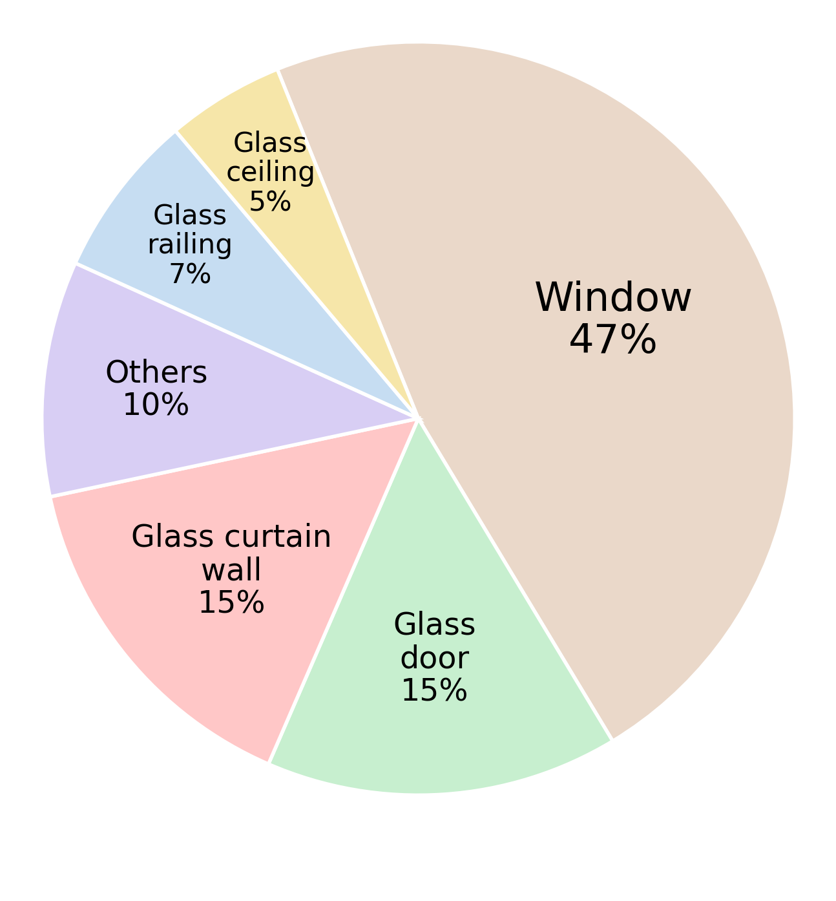

# Glass-Scene Distribution

BrokenGlass 数据集包含六类玻璃场景：窗户（Window）占比最高，为 47%；玻璃门（Glass door）和玻璃幕墙（Glass curtain wall）各占 15%；其他类型（Others）占 10%；玻璃栏杆（Glass railing）占 7%；玻璃天花板（Glass ceiling）占比最低，为 5%。

| Scene type | 报告占比 |
|---|---:|
| Window | 47% |
| Glass door | 15% |
| Glass curtain wall | 15% |
| Others | 10% |
| Glass railing | 7% |
| Glass ceiling | 5% |

给定的整数百分比合计为 99%，这是比例取整造成的误差。图中标签严格保留上述报告数值，不擅自修改任何类别；饼图角度由绘图库按照 `47:15:15:10:7:5` 的相对比例归一化到 360°。样式参照用户提供的绘图代码：7.2×7.6 inches、180 DPI、柔和纯色配色和白色粗分隔线，不使用纹理；类别及百分比直接放在扇区内部，不设置标题或图例。

下载：[PNG](assets/dataset_statistics/glass_scene_distribution.png) · [SVG](assets/dataset_statistics/glass_scene_distribution.svg) · [PDF](assets/dataset_statistics/glass_scene_distribution.pdf) · [CSV](assets/dataset_statistics/glass_scene_distribution.csv) · [统计 JSON](assets/dataset_statistics/glass_scene_distribution.json)。可复现脚本：[plot_glass_scene_distribution.py](../experiments/plot_glass_scene_distribution.py)。
