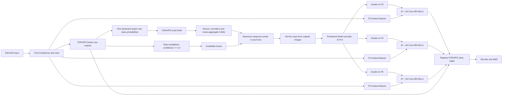

# Golden Multi-head Direct：论文写作方法、数据集与实验基准

更新日期：2026-09-03

本文档面向论文写作，集中记录当前被选为 **golden 方案** 的
P3+P4+P5 Multi-head Direct Grad-CAM/Detail 融合模型。文档中的结论和数字均来自当前仓库中的
训练记录、测试日志、checkpoint 与实际数据目录核验，不以旧的人工汇总值替代可复查结果。

本文档使用以下术语：

- **YOLO baseline**：在 BGD 数据集上训练/微调后的纯 YOLO，权重为
  `yolo-runs/train/train10/weights/best.pt`。
- **historical Best318**：历史联合模型 `best318.pt`。它已经包含 Detail 与 Grad-CAM
  融合，因此不是无融合 baseline。
- **golden model**：本次选定的第二次 P3+P4+P5 Multi-head Direct 完整训练结果，权重为
  `experiments/runs/best318_multihead_all_detectconv_direct_e50_lr1e4_rerun2/weights/best.pt`。

> 论文中建议将 golden model 称为“proposed multi-scale direct fusion model”或
> “P3–P5 multi-head direct fusion model”。“golden”仅作为项目内部的版本标记。

## 1. 可直接用于论文的核心结论

在统一的 BGD test 协议下，纯 YOLO baseline 的 Precision、Recall、mAP50、mAP75 和
mAP50–95 分别为 93.2735%、88.8889%、92.6368%、89.8112% 和 87.0250%。Golden
Multi-head Direct 模型对应指标为 95.9459%、91.0256%、94.6014%、91.4087% 和
89.1513%，相对纯 YOLO 分别提高 2.6724、2.1368、1.9646、1.5975 和 2.1263 个百分点。

Golden 模型在当前 head 系列中取得最好的综合结果：Precision、mAP50 和 mAP50–95
均为当前所列方案最高，Recall 也明显高于纯 YOLO。需要严谨说明的是，它并非在每一个
单项指标上都最高：P4 learnable-alpha 单头模型的 mAP75 为 91.6356%，比 golden 的
91.4087% 高 0.2269 个百分点；第一次 multi-head run 的 Recall 和 mAP75 也略高于
golden rerun。因此论文中宜使用“综合性能最佳”而不是“所有指标绝对最优”。

当前实现的精度收益伴随显著的计算代价。相同 GPU、batch=1 和 imgsz=640 条件下，
模型报告的 inference time 从纯 YOLO 的 1.6835 ms/image 增加到 53.6105 ms/image，
约为 31.84 倍。该代价主要来自推理阶段的梯度反传、CPU/Numpy CAM 聚合、原图磁盘读取、
候选区域搜索与 Detail 编码，而不是简单增加三个卷积头造成的。

## 2. Baseline 的严格定义

### 2.1 论文主 baseline

论文主 baseline 必须使用纯 YOLO checkpoint：

```text
yolo-runs/train/train10/weights/best.pt
```

其 SHA-256 为：

```text
50b678bfca1b11d35363e9730afb450a560ec551beb521f1c9cfd0710efb0e52
```

该 checkpoint 是所有本组 head-fusion 实验使用的 YOLO 初始化权重，因此它既满足“普通
YOLO 在 BGD 数据集上训练”的方法定义，也与 golden 模型具有直接的权重谱系关系。

纯 YOLO 使用 `ultralytics/models/v8/yolov8_wdw.yaml`，是单类别、P3/P4/P5 检测输出的
YOLOv8n 量级模型。训练态参数量为 3,011,043；Conv-BN 融合后的测试日志报告为
3,005,843 个参数和 8.1 GFLOPs。

统一 baseline 测试日志把这个权重显示为 `best_new.pt`；仓库核验表明 `best_new.pt` 与
`yolo-runs/train/train10/weights/best.pt` 的文件大小和 SHA-256 完全一致，因此不是另一套模型。

### 2.2 `best318.pt` 不是 baseline

`best318.pt` 是历史 BGD 联合模型，已经使用 P4/mid Grad-CAM、64×64 Detail crop 和
direct logit replacement。它应作为 historical method 单独报告，不能标记为“无融合
baseline”。它在统一 test 协议下的 mAP50–95 为 87.2197%，只比纯 YOLO baseline 高
0.1948 个百分点。

### 2.3 Baseline 训练记录的可复现性说明

纯 YOLO 的归档训练参数位于 `yolo-runs/train/train10/args.yaml`。该文件保留了旧机器上的
绝对数据路径 `/home/bme-2020/czy/yolov10/data.yaml`，而当前统一评估使用
`experiments/bg_local.yaml` 指向 `/home/user/projects/czy/mydata`。现有项目记录将
`train10` 视为 BGD 纯 YOLO baseline，但仅凭旧绝对路径无法在论文归档层面证明旧训练目录
与当前目录逐文件完全一致。投稿前建议冻结 train/val/test manifest，并记录每个样本的哈希。

## 3. 当前 BGD 数据集

### 3.1 数据配置与任务定义

Golden run 实际使用的数据配置为：

```text
experiments/bg_local.yaml
```

配置指向以下 active split：

```text
/home/user/projects/czy/mydata/images/train
/home/user/projects/czy/mydata/images/val
/home/user/projects/czy/mydata/images/test
```

任务是单类别目标检测：

| 类别 ID | 配置中的类别名 | 中文表述建议 |
|---:|---|---|
| 0 | `Broken glass` | 破碎玻璃 |

标签采用 YOLO normalized `class x_center y_center width height` 格式。背景图像对应空标签文件，
不是第二个检测类别。

### 3.2 Split 规模与类别分布

统计口径是“由 active image split 实际引用的图像及同 stem 标签”，与 Ultralytics dataloader
的加载规则一致。

| Split | 图像数 | 占全部图像 | 含目标图 | 纯背景图 | 背景占比 | Broken glass 实例 | 每张正样本平均实例 | Active 数据大小 |
|---|---:|---:|---:|---:|---:|---:|---:|---:|
| Train | 1,832 | 46.58% | 1,421 | 411 | 22.43% | 1,462 | 1.029 | 1.880 GiB |
| Validation | 503 | 12.79% | 407 | 96 | 19.09% | 422 | 1.037 | 0.750 GiB |
| Test | 1,598 | 40.63% | 206 | 1,392 | 87.11% | 234 | 1.136 | 1.144 GiB |
| **Total** | **3,933** | **100%** | **2,034** | **1,899** | **48.28%** | **2,118** | **1.041** | **3.774 GiB** |

“Active 数据大小”仅统计当前 split 中的图像和与之匹配的标签文本，不包含 cache、未引用标签、
历史目录或实验产物。

由于只有一个前景类别，论文中的 per-class AP 与日志中的 aggregate AP 是同一个类别的结果。
类别规模应同时报告为：2,118 个 `Broken glass` bounding boxes，分布在 2,034 张正样本图像中；
另外有 1,899 张不含目标的背景图像。

### 3.3 每张图像的目标数量

| Split | 0 个目标 | 1 个目标 | 2 个目标 | 3 个目标 | 4 个目标 | 5 个目标 |
|---|---:|---:|---:|---:|---:|---:|
| Train | 411 | 1,383 | 36 | 1 | 1 | 0 |
| Validation | 96 | 395 | 10 | 1 | 1 | 0 |
| Test | 1,392 | 187 | 13 | 4 | 1 | 1 |

整个数据集以单目标正样本为主，只有 69 张图像含有两个或更多标注目标。

### 3.4 Bounding-box 尺度分布

以下面积均为 YOLO 标签中的 normalized width × normalized height，即 bounding box 占原图
面积的比例，不是分割掩码面积。

| Split | 宽度中位数 | 高度中位数 | 面积 Q1 | 面积中位数 | 面积 Q3 | 平均面积 |
|---|---:|---:|---:|---:|---:|---:|
| Train | 0.6703 | 0.8794 | 0.3490 | 0.5384 | 0.7440 | 0.5368 |
| Validation | 0.6667 | 0.8491 | 0.3239 | 0.5486 | 0.7395 | 0.5327 |
| Test | 0.3753 | 0.5000 | 0.1142 | 0.1979 | 0.3382 | 0.2392 |

Test 中目标框的相对面积明显小于 train/validation。该差异说明 test 不只是训练分布的简单随机
子集，而具有更强的目标尺度变化；论文可以把它描述为更具挑战性的测试设置，但不能在缺少数据
构建记录的情况下宣称这是刻意设计的 domain-shift benchmark。

### 3.5 背景分布与数据集解释

Train 和 validation 的背景比例分别为 22.43% 和 19.09%，而 test 的背景比例达到 87.11%。
Test 中 1,392 张纯背景图均为 1920×1080；validation 中 96 张纯背景图均为 4000×2250。
这表明不同 split 的背景图来源或采集设置可能存在系统性差异。

这一结构对实验解释有两个直接影响：

1. Test 对 false positive suppression 非常敏感，Precision 的提升具有实际意义。
2. Test 不是普通的类别均衡测试集。论文必须明确报告背景图数量，避免读者把 1,598 张图误解为
   1,598 张含目标图像。

### 3.6 数据完整性核验

截至 2026-09-03，对当前 active split 的核验结果为：

- 每张 active image 都有同 stem 标签文件。
- 1,899 张背景图均对应空标签；没有缺失标签。
- 所有 2,118 行有效标注的 class ID 均为 0；没有无法解析的标注行。
- Train、validation、test 之间没有重复文件名或重复 stem。
- 对全部 3,933 张 active image 做 SHA-256 内容检查，split 之间没有完全相同的图像文件。

标签目录中存在未被 active image split 引用的历史标签：`labels/train` 有 2,745 个 `.txt`，
`labels/val` 和 `labels/test` 各有 4,137 个 `.txt`。Ultralytics 按图像 stem 匹配，因此这些多余
标签没有进入本次训练或测试。论文统计和后续 manifest 构建必须继续以 active image 为主键，
不能直接对整个 label 目录执行 `find | wc -l`。

### 3.7 论文尚需补齐的数据集元信息

当前仓库无法可靠恢复以下信息，不能在文章中猜测：

- 图像的具体采集地点、设备、时间和拍摄距离；
- 原始数据来源、许可协议和纳入/排除标准；
- bounding box 的标注工具、标注者人数、复核流程和一致性；
- train/validation/test 的构建原则，以及背景图为何在 test 中占 87.11%；
- 是否存在同一场景的相邻帧跨 split 分布。当前 SHA-256 检查只能排除完全相同的文件，不能排除
  近重复帧或同场景图像。

正式投稿前应从数据构建记录中补齐上述信息，并进一步执行感知哈希或特征相似度近重复检查。

## 4. Golden Multi-head Direct 方法

### 4.1 相对纯 YOLO 的总体改动

纯 YOLO 只执行 backbone、neck、P3/P4/P5 Detect heads、decode 与 NMS。Golden 模型在不改变
YOLO bounding-box regression 分支的前提下，引入 Grad-CAM 定位、Detail crop encoder 和三个
尺度独立的分类融合投影，并直接重算三个 Detect level 的分类 logits。



### 4.2 Hook 位置与多尺度设计

三个 hook 按固定的 P3、P4、P5 顺序放在：

```text
Detect.cv3[0][1]  -> P3 / high-resolution head
Detect.cv3[1][1]  -> P4 / mid-resolution head
Detect.cv3[2][1]  -> P5 / low-resolution head
```

输入为 640×640 时，这三个检测尺度通常对应 stride 8、16、32。实现读取每个 hook 的 64-channel
activation，并为三个尺度分别保留独立融合投影。它不是复制三套 YOLO：backbone、neck、Detail
encoder 和一次 CAM/Detail 计算由三个头共享，只有尺度投影与原 Detect 分类支路彼此独立。

### 4.3 Candidate 生成

YOLO 首次 forward 后得到解码预测与三个尺度的 raw head tensors。对唯一类别的预测分数使用内部
阈值 `candidate_conf=0.2`：

\[
\mathcal{C}=\{i\mid p_i>0.2\}.
\]

候选阈值只决定哪些预测触发 crop/Detail 路径；它与最终 test 的 `conf=0.5` 不同。当前实现对
阈值以上的 raw predictions 直接生成候选，进入 Detail 前没有执行常规 NMS。

### 4.4 三尺度 Grad-CAM

CAM target 是每张图像所有 raw anchors 的类别概率之和。实现执行一次 target backward，同时获得
P3、P4、P5 hooked activations 的梯度。对尺度 \(l\) 和通道 \(k\)，Grad-CAM 权重与热图可写为：

\[
\alpha_k^{(l)}=\frac{1}{H_lW_l}\sum_{u,v}
\frac{\partial T}{\partial A_{k,u,v}^{(l)}},
\qquad
M^{(l)}=\operatorname{ReLU}\left(\sum_k\alpha_k^{(l)}A_k^{(l)}\right).
\]

每个尺度的 CAM 被 resize 到输入图像大小并独立归一化，之后对三个尺度取均值，得到共享定位热图：

\[
M=\operatorname{Normalize}\left(
\frac{1}{3}\sum_{l\in\{P3,P4,P5\}}
\operatorname{Normalize}(\operatorname{Resize}(M^{(l)}))
\right).
\]

### 4.5 CAM 引导的局部 crop

对每个 candidate box，方法在 box 内寻找热图响应和最大的固定窗口，并把窗口中心映射回原始图像。
如果 candidate box 小于窗口或局部搜索失败，则退回 candidate box 中心。随后从磁盘重新读取原图，
裁出 64×64 RGB patch，并使用 ImageNet mean/std 归一化。

该位置选择与 OpenCV crop 是离散且不可微的；训练梯度不会穿过中心选择和原图裁剪过程。

### 4.6 Detail encoder

每个 64×64 crop 输入独立预训练的 `Detail_Net_attn_block`。Golden run 使用历史宽通道版本，
包含 large、medium、small 三条 residual/attention route。三条 route 分别压缩为一个通道并拼接，
输出一个 3×4×4 的局部细节张量。

Detail encoder 的预训练权重为：

```text
run/detail_net_attn.pt
SHA-256: 7d6c2af44137c1eb8169bf282d702cfc78d3090b9ebbb75c1cd6b3714e84556e
```

### 4.7 Detail feature scatter 与直接分类融合

同一组 3×4×4 Detail features 被分别散射到 P3、P4、P5 对应的空间坐标。若同一位置收到多个
candidate 的 Detail feature，当前实现使用加法累积。对每个尺度 \(l\)：

\[
\tilde A^{(l)}=\operatorname{ReLU}
\left(\operatorname{BN}^{(l)}
\left(\operatorname{Conv}_{3\times3}^{(l)}
\left([A^{(l)};S^{(l)}]\right)\right)\right),
\]

其中 \(A^{(l)}\) 是 64-channel hooked feature，\(S^{(l)}\) 是 3-channel scattered Detail
map，拼接后为 67 channels。三个尺度各自使用独立的
`Conv2d(67,64,3,padding=1) + BatchNorm2d(64) + ReLU`。

融合后的 64-channel feature 继续通过该尺度原有的最终分类卷积：

\[
z_{cls}^{\prime(l)}=\operatorname{Conv}_{cls}^{(l)}(\tilde A^{(l)}).
\]

新的分类 logit 直接替换对应 head 的原分类 logit。该模式没有 alpha 插值、没有额外
`fusion_alpha` 参数；checkpoint method ID 为：

```text
best318_framework_multi_head_direct_v1
```

Bounding-box DFL/regression channels 保持原始 YOLO 输出，不进行 Detail 修正。替换分类 logit 后，
模型重新 decode，并使用正常的 confidence filtering 与 NMS 得到最终检测结果。

当前代码存在一个投稿前必须核验的坐标顺序问题：`find_max_heatmap_center_torch` 明确返回
`[x, y]`，而 scatter slice 把 `current_center[0]` 用作 feature-map 的第一空间维、
`current_center[1]` 用作第二空间维；PyTorch feature map 的空间索引通常应为 `[y, x]`。这可能
意味着 golden checkpoint 实际学习的是转置后的 Detail scatter 位置。本文其余部分描述方法意图，
但当前 checkpoint 的结果对应现有实现行为。若确认并修复该问题，必须重新训练和测试，不能沿用
当前 golden 数字。

### 4.8 相对 YOLO 的改动汇总

| 组件 | 纯 YOLO | Golden Multi-head Direct |
|---|---|---|
| Backbone/neck | YOLO 原结构 | 保留并参与联合微调 |
| Box regression | P3/P4/P5 原生分支 | 完全保留，不做融合替换 |
| Classification | 原生三尺度分类 logits | 三尺度均用 Detail 融合 feature 重算并直接替换 |
| 候选生成 | decode 后直接进入阈值/NMS | 先用 0.2 阈值选择 Detail candidates，最终仍按 0.5 测试阈值评估 |
| 可解释性特征 | 无 | P3/P4/P5 Grad-CAM，三尺度归一化聚合 |
| 局部输入 | 无 | 每个 candidate 对应一个原图 64×64 crop |
| 局部编码 | 无 | 预训练三路 residual-attention Detail encoder |
| 融合层 | 无 | 每尺度独立 67→64 Conv-BN-ReLU |
| Alpha/gate | 无 | 无；直接替换 |
| 推理梯度 | 不需要 | 需要一次 Grad-CAM backward |

## 5. 参数量与模型文件

### 5.1 可训练参数

| 模块 | 参数量 | 说明 |
|---|---:|---|
| 纯 YOLO | 3,011,043 | Golden 的检测器初始化 |
| Detail encoder | 1,159,449 | 历史宽通道 `Detail_Net_attn_block` |
| 三个独立融合投影 | 116,352 | 每尺度 38,784 个 Conv-BN 参数 |
| **Golden total** | **4,286,844** | 50 epochs 中全部 `requires_grad=True` |

Golden 比纯 YOLO 增加 1,275,801 个参数，即增加 42.37%。Conv-BN 融合后的测试日志报告
纯 YOLO 为 3,005,843 参数，golden 为 4,281,644 参数；差值仍为 1,275,801。

当前方法的运行量取决于每张图像中超过 0.2 的 candidate 数量，还包含 backward 与 CPU crop，
因此不能只用静态网络 GFLOPs 完整描述开销。论文应同时报告参数量、实测 latency 和硬件环境。

### 5.2 Checkpoint 大小

| Checkpoint | 文件大小 | SHA-256 |
|---|---:|---|
| YOLO baseline | 6,226,009 B（5.94 MiB） | `50b678bfca1b11d35363e9730afb450a560ec551beb521f1c9cfd0710efb0e52` |
| Detail pretraining | 18,063,767 B（17.23 MiB） | `7d6c2af44137c1eb8169bf282d702cfc78d3090b9ebbb75c1cd6b3714e84556e` |
| Golden `best.pt` | 684,152,405 B（652.46 MiB） | `8cc1d899c10fa9cd9860bca542fa8bc0e85dd446c32766ef9db84b8c5faf0daa` |

Golden checkpoint 约为纯 YOLO 文件的 109.9 倍，但这个比例远高于 1.42 倍的参数量比例，主要反映
旧式 checkpoint 序列化了完整 Python runtime/wrapper，而不是实际参数或部署内存增加 109.9 倍。
文章中不要把 checkpoint 文件大小直接当作模型参数规模。

## 6. Golden 训练设置

### 6.1 初始化与训练策略

Golden run 不从 `best318.pt` 初始化。它从两套独立预训练权重构建：

1. YOLO：`yolo-runs/train/train10/weights/best.pt`；
2. Detail：`run/detail_net_attn.pt`；
3. 三个融合投影随机初始化；
4. YOLO、Detail 与三个融合投影一起进行全网络联合 fine-tuning。

因此公平的训练谱系是“BGD-finetuned YOLO + independently pretrained Detail + 50-epoch joint
fine-tuning”。论文若讨论总训练成本，不能只报告最后 50 epochs，还应把 YOLO 与 Detail 的独立
预训练成本纳入说明；目前 Detail 预训练的完整超参数和耗时尚未在本文件中恢复。

归档记录中的纯 YOLO 与 golden 联合微调并不是从零开始、训练预算完全相同的两次训练。两者的
主要训练配置如下：

| 参数 | Pure YOLO `train10` 归档值 | Golden joint fine-tuning |
|---|---|---|
| 初始化 | `yolov8_wdw.yaml`, `pretrained=False` | Pure YOLO checkpoint + Detail checkpoint |
| Epochs | 300 | 50 |
| Optimizer | `auto` | AdamW |
| `lr0` | 0.01（归档配置值） | 0.0001 |
| `lrf` | 0.01 | 0.01 |
| Momentum | 0.937 | 0.937 |
| Weight decay | 0.0005 | 0.0005 |
| Warmup epochs | 3.0 | 3.0 |
| Warmup momentum | 0.8 | 0.8 |
| Warmup bias LR | 0.1 | 0.0 |
| Batch / imgsz | 32 / 640 | 32 / 640 |
| Workers | 8 | 2 |
| AMP | True | True |
| Seed / deterministic | 0 / True | 0 / True |

这里的 baseline 仍然适合回答“在已经训练好的普通 YOLO 上增加本文方法能获得多少收益”，但不能
回答“两个模型在完全相同的从零训练预算下谁更好”。论文应把 golden 的 50 epochs 表述为在两个
预训练分支上的联合 fine-tuning。

### 6.2 训练超参数

| 参数 | Golden 配置 |
|---|---|
| Epochs | 50 |
| Input size | 640×640 |
| Batch size | 32 |
| Optimizer | AdamW |
| Initial learning rate `lr0` | 1×10⁻⁴ |
| Final LR factor `lrf` | 0.01 |
| Momentum / beta1 配置值 | 0.937 |
| Weight decay | 5×10⁻⁴ |
| Warmup epochs | 3.0 |
| Warmup momentum | 0.8 |
| Warmup bias LR | 0.0 |
| Box / cls / DFL loss weights | 7.5 / 0.5 / 1.5 |
| Internal candidate confidence | 0.2 |
| Patience | 50 |
| AMP | Enabled |
| Workers | 2 |
| Device | CUDA device 0 |
| Seed | 0 |
| Deterministic | True |
| Rectangular training | False |
| Cache | False |
| Trainable scope | Whole network |

### 6.3 数据增强

Golden run 没有使用 `--no-augment`，因此沿用 Ultralytics 记录的增强配置：

| Augmentation | Value |
|---|---:|
| HSV hue / saturation / value | 0.015 / 0.7 / 0.4 |
| Translation | 0.1 |
| Scale | 0.5 |
| Horizontal flip | 0.5 |
| Vertical flip | 0.0 |
| Mosaic | 1.0 |
| MixUp | 0.0 |
| Copy-paste | 0.0 |
| Degrees / shear / perspective | 0.0 / 0.0 / 0.0 |

### 6.4 等价复现实验命令

```bash
python -u experiments/run_318_fusion_alpha.py train \
  --multi-head-direct \
  --multi-heads high mid low \
  --candidate-conf 0.2 \
  --epochs 50 \
  --optimizer AdamW \
  --lr0 0.0001 \
  --lrf 0.01 \
  --momentum 0.937 \
  --weight-decay 0.0005 \
  --warmup-epochs 3.0 \
  --warmup-momentum 0.8 \
  --warmup-bias-lr 0.0 \
  --batch 32 \
  --workers 2 \
  --device 0 \
  --amp \
  --patience 50 \
  --save-period -1 \
  --name best318_multihead_all_detectconv_direct_e50_lr1e4_rerun2 \
  --wandb-mode online
```

当前工作树中的运行脚本还包含后续 P4 pre-Detect 实验改动。Multi-head Direct 的原始实现提交为：

```text
5251d46075a7d764a868e2a143d6c7d89ac0045b
```

论文复现时应记录具体 commit，不只记录脚本文件名。

### 6.5 训练产物

- Run name：`best318_multihead_all_detectconv_direct_e50_lr1e4_rerun2`
- W&B：<https://wandb.ai/zing_c-ningbo-university/BGD-YOLO/runs/7k3zhkgt>
- 训练耗时：4.789 hours，硬件为 NVIDIA RTX 6000 Ada Generation
- Training CSV：
  `experiments/runs/best318_multihead_all_detectconv_direct_e50_lr1e4_rerun2/results.csv`
- Golden checkpoint：
  `experiments/runs/best318_multihead_all_detectconv_direct_e50_lr1e4_rerun2/weights/best.pt`
- Last checkpoint：
  `experiments/runs/best318_multihead_all_detectconv_direct_e50_lr1e4_rerun2/weights/last.pt`

Training CSV 中最高 validation mAP50–95 出现在 CSV epoch 20（第 21 个 epoch），为 0.91496；
最高 validation mAP50 出现在 CSV epoch 35（第 36 个 epoch），为 0.97265。最终用于统一 test 的
`best.pt` 完成后回验结果与 epoch 35 对齐：P=0.97192、R=0.93365、mAP50=0.97265、
mAP75=0.93582、mAP50–95=0.91350。该历史 fork 按 validation mAP50 选择 `best.pt`，因此正文必须
区分“CSV 中最高 mAP50–95 的 epoch”和“实际 test 使用的 best.pt”。

## 7. 统一测试协议与结果

### 7.1 软件与硬件

| 项目 | 配置 |
|---|---|
| GPU | NVIDIA RTX 6000 Ada Generation, 48,536 MiB |
| Python | 3.11.0 |
| PyTorch | 2.7.0+cu128 |
| Ultralytics | YOLOv8.0.114 |
| Split | test |
| Images / instances | 1,598 / 234 |
| Input size | 640×640 |
| Batch | 1 |
| Final confidence threshold | 0.5 |
| NMS IoU | 0.5 |
| Device | GPU 0 |

### 7.2 Golden 与纯 YOLO baseline

| Model | Precision | Recall | F1 | mAP50 | mAP75 | mAP50–95 | Inference ms/image |
|---|---:|---:|---:|---:|---:|---:|---:|
| Pure YOLO baseline | 0.932735 | 0.888889 | 0.910284 | 0.926368 | 0.898112 | 0.870250 | **1.6835** |
| Golden Multi-head Direct | **0.959459** | **0.910256** | **0.934211** | **0.946014** | **0.914087** | **0.891513** | 53.6105 |
| Absolute change | **+0.026724** | **+0.021368** | **+0.023926** | **+0.019646** | **+0.015975** | **+0.021263** | +51.9270 ms |

换算为百分点，golden 相对纯 YOLO 的提升为：

- Precision：+2.6724 pp
- Recall：+2.1368 pp
- F1：+2.3926 pp
- mAP50：+1.9646 pp
- mAP75：+1.5975 pp
- mAP50–95：+2.1263 pp

mAP50–95 的相对增幅为 2.4433%，但论文主文建议优先报告绝对百分点提升，避免把相对百分比与
percentage points 混淆。

### 7.3 Head 实验定位

| Model | Head / fusion | P | R | mAP50 | mAP75 | mAP50–95 | ms/image |
|---|---|---:|---:|---:|---:|---:|---:|
| Pure YOLO baseline | No Detail fusion | 0.932735 | 0.888889 | 0.926368 | 0.898112 | 0.870250 | **1.68** |
| Historical `best318.pt` | P4 direct | 0.954128 | 0.888889 | 0.926514 | 0.901398 | 0.872197 | 54.90 |
| Single-head | P3 direct | 0.942222 | 0.905983 | 0.937386 | 0.907642 | 0.882735 | 53.11 |
| Single-head | P4 fixed alpha=0.5 | 0.945701 | 0.893162 | 0.932220 | 0.912353 | 0.882639 | 53.03 |
| Single-head | P4 learnable alpha | 0.945510 | 0.889851 | 0.935196 | **0.916356** | 0.885936 | **52.15** |
| Single-head | P5 fixed alpha=0.5 | 0.950123 | 0.895489 | 0.935050 | 0.916033 | 0.887504 | 53.33 |
| **Golden** | **P3+P4+P5 direct** | **0.959459** | **0.910256** | **0.946014** | 0.914087 | **0.891513** | 53.61 |

该表可以说明 golden 的选择，但不是严格的 head-only ablation：P3 使用 direct，P4/P5 的部分结果
使用 alpha=0.5，控制变量并不完全一致。论文若把它命名为正式 head ablation，应补跑同一 fusion
rule 下完整的 P3/P4/P5 单头组。

### 7.4 两次 Multi-head run

| Run | P | R | mAP50 | mAP75 | mAP50–95 | ms/image |
|---|---:|---:|---:|---:|---:|---:|
| First multi-head | 0.955302 | **0.913360** | 0.943453 | **0.920430** | 0.891103 | 54.13 |
| Golden rerun | **0.959459** | 0.910256 | **0.946014** | 0.914087 | **0.891513** | **53.61** |

第二次 run 的 mAP50–95 比第一次高 0.0410 pp，说明主要 AP 结果接近；但两次都记录为 seed 0，
不能替代多个独立随机种子的均值、标准差或置信区间。论文目前只能报告单个预声明 checkpoint 的
确定性结果，不应声称差异具有统计显著性。

## 8. 耗时分析

### 8.1 模型报告的分阶段耗时

| Stage | Pure YOLO | Golden | Golden / YOLO |
|---|---:|---:|---:|
| Preprocess | 0.1229 ms | 0.1423 ms | 1.16× |
| Inference | 1.6835 ms | 53.6105 ms | **31.84×** |
| Loss bookkeeping | 0.0036 ms | 0.0037 ms | 1.05× |
| Postprocess | 0.1333 ms | 0.2268 ms | 1.70× |
| Sum of reported stages | 1.9433 ms | 53.9834 ms | 27.78× |

仅按模型报告的 inference time 换算，纯 YOLO 与 golden 的理论吞吐分别约为 594.0 和
18.65 images/s。实际完整 validation progress 分别为约 71.40 和 14.14 images/s，即完整循环中
golden 约慢 5.05 倍。两种数字衡量的范围不同：前者突出模型计算开销，后者还包含 dataloader、
磁盘 I/O、指标更新与 Python 循环。

### 8.2 当前实现慢的原因

1. **推理时需要 backward**：Grad-CAM 必须保留 activation 和 gradient，无法使用普通 YOLO 的
   纯 `torch.no_grad()` 快速路径。
2. **GPU→CPU 同步**：三个尺度的 activation 和 gradient 被转为 CPU Numpy 后计算 CAM，造成同步
   与数据搬运。
3. **原图重复读取**：每次 forward 会依据 `im_file` 使用 OpenCV 从磁盘重新读取原图，而不是复用
   dataloader 已加载的 tensor。
4. **动态候选开销**：confidence≥0.2 的每个 raw candidate 都需要中心搜索和 64×64 crop；开销随
   candidate 数变化。
5. **滑窗中心搜索**：每张图像动态创建固定权重卷积，对热图执行窗口和搜索。
6. **Detail 编码**：所有 candidate crops 还要通过三路 residual-attention Detail encoder。
7. **二次分类与 decode**：三个尺度均重算分类 logits，并在替换后再次 decode。
8. **Python 控制流较多**：candidate、batch 与尺度散射包含 Python loops，不利于 GPU 并行和部署导出。

Multi-head 并没有执行三套完整的 crop/Detail 流程：三个尺度共享一次 target backward、一个聚合 CAM
和一次 Detail batch forward。因此它只比单头方案慢约 0.3–1.5 ms，但所有 Grad-CAM/Detail 方案都
比纯 YOLO 慢一个数量级以上。

### 8.3 论文中的推荐表述

可以写成：

> The proposed multi-head fusion model improves mAP50–95 by 2.13 percentage points over the
> BGD-finetuned YOLO baseline. This accuracy gain comes at a substantial computational cost:
> the current research implementation requires gradient-based localization and candidate-wise
> detail encoding during inference, increasing the reported inference latency from 1.68 ms to
> 53.61 ms per image on an RTX 6000 Ada GPU.

必须加上“current research implementation”，因为当前耗时包含大量尚未工程优化的 CPU/Numpy、
OpenCV I/O 和 Python loops，不能直接解释为方法理论上必然需要 53.61 ms。另一方面，在真正完成
优化前也不能用纯卷积参数量推算一个更漂亮的部署速度替代实测值。

### 8.4 后续效率优化方向

以下属于未来工作，不是当前 golden 结果的一部分：

- CAM 聚合完全留在 GPU/Torch，删除 `.cpu().numpy()`；
- 复用 dataloader 原图 tensor，删除 forward 内的 `cv2.imread`；
- 用 `grid_sample`/ROIAlign 批量生成 crop，替代 candidate Python loop；
- 对 candidate 做受控 top-k 或 pre-NMS，降低动态 Detail workload；
- 蒸馏 CAM/Detail teacher 到无 backward 的轻量 gating head；
- 缓存或近似 Grad-CAM，用一次前向 saliency predictor 替代 inference-time backward；
- 导出 tensor-only checkpoint，避免 652 MiB 的旧 runtime pickle；
- 分别报告 batch=1 latency、吞吐、峰值显存和 CPU 利用率。

任何优化后模型都应重新做完整 test，不能默认保持当前 AP。

## 9. 论文写作建议

### 9.1 方法段落草稿

本文在 BGD-finetuned YOLO 检测器上引入一种 P3–P5 多尺度直接细节融合方法。首先对检测器的
P3、P4 和 P5 分类特征同时注册 hook，并通过一次类别目标反向传播获得三个尺度的 Grad-CAM。
归一化后的多尺度 CAM 经上采样和平均聚合，用于在每个低阈值候选框内定位高响应区域。随后从
原始图像裁取 64×64 局部 patch，并由独立预训练的三路 residual-attention Detail encoder 编码为
3×4×4 特征。局部特征被散射回三个检测尺度，并分别与 64-channel YOLO feature 拼接；三个独立的
3×3 Conv-BN-ReLU 投影将 67 channels 映射回 64 channels。最后利用各尺度原有分类卷积重算分类
logits，并直接替换原始分类输出，而 bounding-box regression 分支保持不变。

### 9.2 数据集段落草稿

BGD 数据集包含 3,933 张图像和 2,118 个破碎玻璃 bounding-box 标注，任务为单类别目标检测。
Train、validation 和 test 分别包含 1,832、503 和 1,598 张图像，对应 1,462、422 和 234 个目标
实例。数据集中另包含 1,899 张纯背景图；其中 test 的 1,392 张背景图占 test 图像的 87.11%，
构成对 false positive suppression 的压力测试。Test 中目标框的 normalized area 中位数为
0.1979，低于 train 和 validation 的 0.5384 与 0.5486。所有实验将输入 letterbox/resize 到
640×640。当前 active splits 之间未发现同名或 SHA-256 完全重复图像。

### 9.3 实验结果段落草稿

在包含 1,598 张图像和 234 个目标实例的 test split 上，采用 confidence threshold 0.5、NMS IoU
0.5 和 batch size 1 进行统一评估。纯 YOLO baseline 获得 92.64% mAP50 和 87.02%
mAP50–95；提出的 P3–P5 Multi-head Direct 模型分别达到 94.60% 和 89.15%，提高 1.96 和
2.13 个百分点。同时，Precision 和 Recall 分别从 93.27%/88.89% 提升到 95.95%/91.03%。

### 9.4 推荐主结果表标题

> Comparison with the BGD-finetuned YOLO baseline on the background-dominant BGD test set.
> All models are evaluated at 640×640 resolution with confidence threshold 0.5, NMS IoU 0.5,
> and batch size 1 on an NVIDIA RTX 6000 Ada GPU.

### 9.5 避免的表述

- 不要把 `best318.pt` 称为 plain YOLO baseline。
- 不要说 golden “所有指标都最好”；它是当前综合最优，mAP75 不是单项最高。
- 不要把 31.84× inference slowdown 与 5.05× validation-loop slowdown 混为同一个速度定义。
- 不要把背景图当作第二个类别。
- 不要声称没有 near-duplicate；当前只确认没有完全相同的 SHA-256 文件。
- 不要把目前混合 fusion rule 的 P3/P4/P5 表称为严格控制变量的 head ablation。
- 不要只报告最后 50 epochs，而忽略 YOLO 和 Detail 的独立预训练。

## 10. 可复查产物索引

| 内容 | 路径 |
|---|---|
| 数据配置 | `experiments/bg_local.yaml` |
| 纯 YOLO baseline | `yolo-runs/train/train10/weights/best.pt` |
| Baseline 训练参数 | `yolo-runs/train/train10/args.yaml` |
| Baseline 统一测试日志 | `experiments/launch_logs/audit_yolo_baseline_candidates_conf05_iou05_b1_20260821.log` |
| Detail 预训练权重 | `run/detail_net_attn.pt` |
| Golden 实现脚本 | `experiments/run_318_fusion_alpha.py` |
| Golden 训练日志 | `experiments/best318_multihead_all_detectconv_direct_e50_lr1e4_rerun2.train.log` |
| Golden 训练 CSV | `experiments/runs/best318_multihead_all_detectconv_direct_e50_lr1e4_rerun2/results.csv` |
| Golden 测试日志 | `experiments/best318_multihead_all_detectconv_direct_e50_lr1e4_rerun2.test.log` |
| Golden checkpoint | `experiments/runs/best318_multihead_all_detectconv_direct_e50_lr1e4_rerun2/weights/best.pt` |
| 历史 head 实验汇总 | `docs/best318_gradcam_detect_heads_20260821.md` |
| Multi-head 历史说明 | `docs/best318_multihead_direct.md` |

Golden checkpoint 也已发布为：

<https://github.com/zing-c/BGD-Yolo-v2/releases/download/best318-gradcam-heads-20260821/best318_multihead_p3_p4_p5_direct_rerun2_best.pt>

## 11. 投稿前建议完成的最小补充实验

1. 使用至少 3 个独立随机种子报告 mean ± standard deviation。
2. 统一 fusion rule，补齐 P3-only、P4-only、P5-only 和 P3+P4+P5 的严格 head ablation。
3. 对 active dataset 生成冻结 manifest、文件哈希与版本号。
4. 使用 perceptual hash 或视觉 embedding 检查跨 split 近重复和同场景泄漏。
5. 补齐数据来源、许可、标注流程与 split 构建原则。
6. 报告 peak GPU memory、CPU utilization、完整 end-to-end latency 和 batch throughput。
7. 实现至少一个无 inference-time backward 的效率版本，与 golden 做 accuracy–latency trade-off。
8. 明确 checkpoint selection metric，并在所有对照中使用相同的 validation selection rule。

这些补充不会改变当前 golden checkpoint 的已测结果，但会显著增强论文的可复现性、实验公平性与
审稿可信度。
