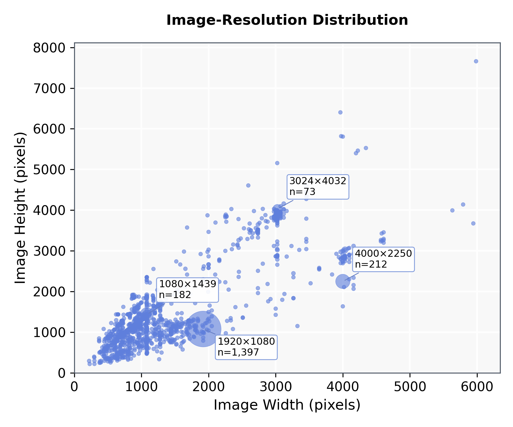

# Image-Resolution Distribution

统计当前正式 `mydata/images/train`、`val`、`test` 中所有实际存在图片的原始存储分辨率。横轴为图片宽度，纵轴为图片高度；相同 `width × height` 聚合为一个气泡，气泡面积随该分辨率的图片数量线性增大，并保留最小显示面积以确保单例分辨率可见。气泡采用中等饱和度的半透明蓝色，外边线与内部使用相同蓝色，密集区域通过透明叠加自然显现，不使用容易发黑的黑色描边。

| Split | 图片数 |
|---|---:|
| Train | 1,832 |
| Val | 503 |
| Test | 1,598 |
| 合计 | 3,933 |

数据包含 1,400 种精确分辨率，宽度范围为 221–5,985 pixels，高度范围为 220–7,660 pixels。最高频分辨率是 `1920×1080`，共 1,397 张，占全部图片的 35.52%。图中只标注位置相对分离的主要高频模式，全部精确分辨率和计数保存在 CSV 中。

画布为 6×5 inches、300 DPI，与 [Ratio of a Broken Region to Its Whole Image](BROKEN_REGION_RATIO_DISTRIBUTION.md) 高度和输出规格一致。图中没有类别图例；每个标注直接给出分辨率和图片数量。

下载：[PNG](assets/dataset_statistics/image_resolution_distribution.png) · [SVG](assets/dataset_statistics/image_resolution_distribution.svg) · [PDF](assets/dataset_statistics/image_resolution_distribution.pdf) · [CSV](assets/dataset_statistics/image_resolution_distribution.csv) · [统计 JSON](assets/dataset_statistics/image_resolution_distribution.json)。可复现脚本：[plot_image_resolution_distribution.py](../experiments/plot_image_resolution_distribution.py)。
