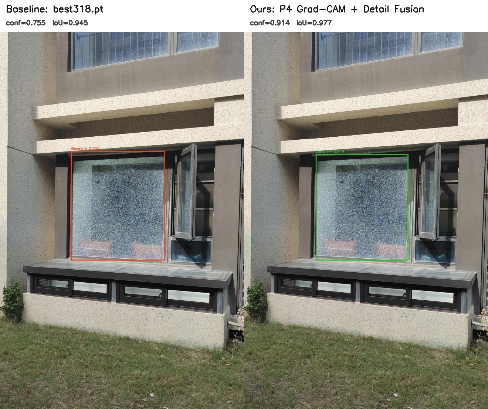
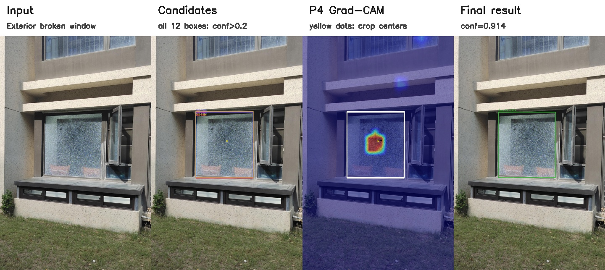
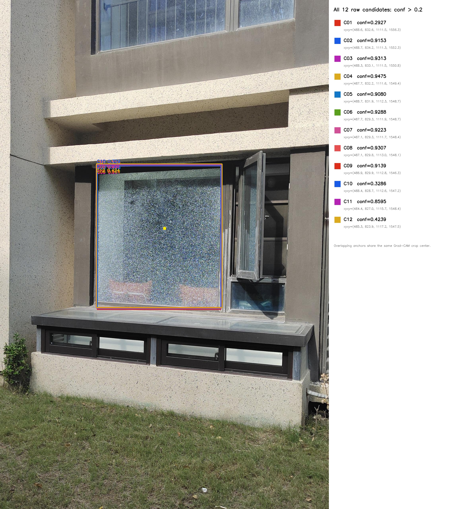
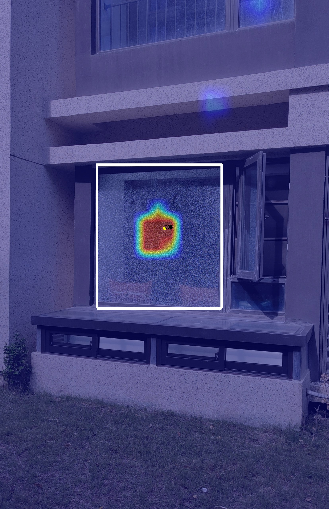
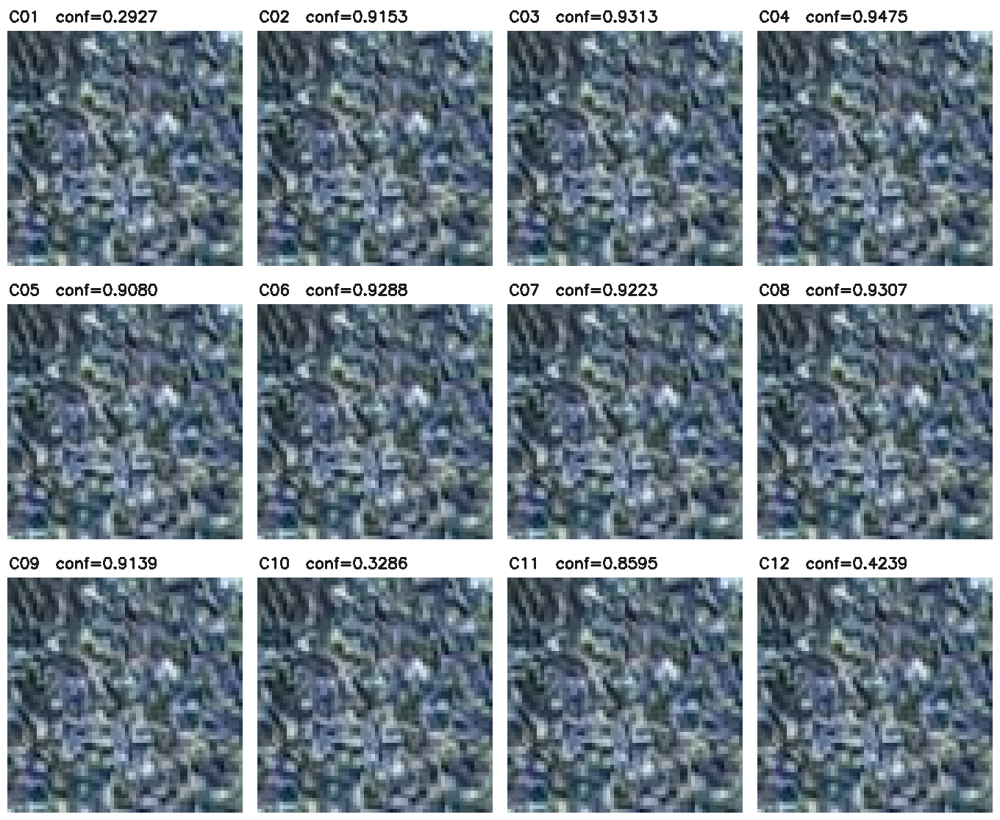
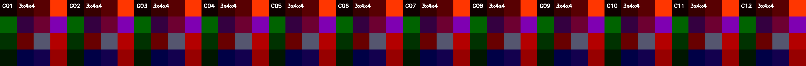

# P4 室外玻璃改进案例与完整候选截图

更新时间：2026-08-23

本页提供论文框架图优先使用的真实测试案例：从建筑外侧拍摄的破损窗户`00587.jpg`。素材完整保留P4方法使用的全部`conf>0.2`原始候选框、每个候选对应的Grad-CAM定位和`64×64`截图，并用相同测试参数对比`best318.pt`基线与P4方法的最终输出。

素材目录：[`docs/assets/p4_exterior_improvement_00587/`](assets/p4_exterior_improvement_00587/)

## 1. 为什么选择`00587.jpg`

筛选过程先检查测试集中206张有标注图片，再人工确认24张明确从建筑外侧、店面外侧或车外拍摄的玻璃场景。最终选择`00587.jpg`，原因如下：

- 拍摄位置明确位于建筑外侧，草地、外墙、窗台和开启的窗扇均可见；
- 破损玻璃面积较大，缩小到论文版面后仍能看清裂纹纹理；
- P4 Grad-CAM在破损窗内有集中且非零的响应；
- 相比`best318.pt`，P4方法在同一张图上同时提高最终置信度和预测框IoU；
- 只有一个ground-truth目标，基线与方法的对应关系明确，适合定性对比。

这张图用于展示方法过程和定性改进。单张图本身不是整体性能证明；统一test集结果显示，P4可学习alpha模型的mAP50-95为`0.885936`，基线为`0.872197`，绝对提升`0.013739`。

## 2. 最终结果对比

两侧使用完全相同的`imgsz=640`、`conf=0.5`和NMS IoU=`0.5`：

| 模型 | 最终检测数 | 匹配置信度 | 与GT的IoU |
| --- | ---: | ---: | ---: |
| `best318.pt`基线 | 1 | `0.754614` | `0.945393` |
| P4 Grad-CAM + Detail融合 | 1 | `0.913647` | `0.977459` |
| 绝对变化 | 0 | **`+0.159033`** | **`+0.032066`** |

因此，这个案例中的改进不是仅改变配色：方法输出框更贴近ground truth，同时目标置信度从约`0.755`提高到`0.914`。

独立最终结果图片：

- [基线最终结果](assets/p4_exterior_improvement_00587/10_baseline_best318_final.jpg)
- [P4方法最终结果](assets/p4_exterior_improvement_00587/11_ours_p4_final.jpg)
- [ground-truth标注](assets/p4_exterior_improvement_00587/02_ground_truth.jpg)

## 3. 框架图推荐流程图

这张横图可直接作为框架图排版参考，四个阶段依次为：室外输入图、全部候选框、P4 Grad-CAM及截图中心、方法最终结果。正式论文图建议使用下列独立高清素材重新排版。

## 4. 全部`conf>0.2`候选框

这里的候选是Detail分支在融合前读取的原始YOLO位置，筛选条件为类别置信度严格大于`0.2`，尚未执行最终NMS。该图共有12个候选框；它们来自不同anchor位置但高度重叠，因此在图像区域中多数边线互相覆盖。右侧图例完整列出了12个框，未进行人工去重或隐藏。

| ID | 候选置信度 | 原图坐标`xyxy` | 实际`64×64`截图 |
| --- | ---: | --- | --- |
| C01 | `0.2927` | `(488.6, 832.6, 1111.5, 1556.3)` | [PNG](assets/p4_exterior_improvement_00587/candidate_crops_64/C01_conf_0.2927.png) |
| C02 | `0.9153` | `(488.7, 834.2, 1111.3, 1552.3)` | [PNG](assets/p4_exterior_improvement_00587/candidate_crops_64/C02_conf_0.9153.png) |
| C03 | `0.9313` | `(488.3, 833.1, 1111.5, 1550.8)` | [PNG](assets/p4_exterior_improvement_00587/candidate_crops_64/C03_conf_0.9313.png) |
| C04 | `0.9475` | `(487.7, 832.2, 1111.6, 1549.4)` | [PNG](assets/p4_exterior_improvement_00587/candidate_crops_64/C04_conf_0.9475.png) |
| C05 | `0.9080` | `(488.7, 831.9, 1112.3, 1548.7)` | [PNG](assets/p4_exterior_improvement_00587/candidate_crops_64/C05_conf_0.9080.png) |
| C06 | `0.9288` | `(487.7, 829.3, 1111.9, 1548.7)` | [PNG](assets/p4_exterior_improvement_00587/candidate_crops_64/C06_conf_0.9288.png) |
| C07 | `0.9223` | `(487.1, 829.3, 1111.7, 1548.4)` | [PNG](assets/p4_exterior_improvement_00587/candidate_crops_64/C07_conf_0.9223.png) |
| C08 | `0.9307` | `(487.1, 829.8, 1113.0, 1548.1)` | [PNG](assets/p4_exterior_improvement_00587/candidate_crops_64/C08_conf_0.9307.png) |
| C09 | `0.9139` | `(486.9, 829.9, 1112.8, 1546.3)` | [PNG](assets/p4_exterior_improvement_00587/candidate_crops_64/C09_conf_0.9139.png) |
| C10 | `0.3286` | `(488.4, 828.7, 1112.6, 1547.2)` | [PNG](assets/p4_exterior_improvement_00587/candidate_crops_64/C10_conf_0.3286.png) |
| C11 | `0.8595` | `(484.4, 827.0, 1115.7, 1548.4)` | [PNG](assets/p4_exterior_improvement_00587/candidate_crops_64/C11_conf_0.8595.png) |
| C12 | `0.4239` | `(485.3, 823.9, 1117.2, 1547.5)` | [PNG](assets/p4_exterior_improvement_00587/candidate_crops_64/C12_conf_0.4239.png) |

候选置信度是细节融合前的筛选分数；最终的`0.913647`是完成P4细节融合并重新解码、NMS后的输出分数，两者不应混为同一阶段。

## 5. P4 Grad-CAM确实有值

Grad-CAM来自`Detect.cv3[1][1]`，对应P4中层检测头。原图尺度热图统计如下：

| 项目 | 数值 |
| --- | ---: |
| 热图尺寸 | `2560×1655` |
| 最小值 | `0.0` |
| 最大值 | `0.999500` |
| 非零像素数 | `160,612` |
| 像素值总和 | `41,582.652344` |

白框表示高度重叠的候选区域，黄色点表示实际截图中心。12个候选均在同一破损窗区域内，积分窗口搜索得到相同中心`(828, 1148)`。因此模型真实前向会产生12份内容相同的截图；素材按模型行为全部保留，没有只保留一份代表图。

- [不叠加原图的单通道Grad-CAM热图](assets/p4_exterior_improvement_00587/05_p4_gradcam_heatmap.png)

## 6. 全部截图与Detail特征

截图合集：

- [12张模型实际使用的`64×64`截图](assets/p4_exterior_improvement_00587/candidate_crops_64/)
- [12张最近邻放大的`320×320`预览](assets/p4_exterior_improvement_00587/candidate_crops_preview/)

每张截图都带候选ID和该候选在融合前的置信度。由于12个候选共享同一个Grad-CAM中心，截图像素相同，这是原算法的真实输出，而不是文件复制错误。

每张`3×64×64`截图经过Detail Encoder后得到`3×4×4`特征。上图依次显示C01至C12的三通道RGB组合；完整张量尺寸为`12×3×4×4`。

## 7. 融合前后特征图

| 阶段 | 图片 | 张量尺寸 |
| --- | --- | --- |
| P4 Hook激活的通道绝对值均值 | [08_p4_activation_mean.png](assets/p4_exterior_improvement_00587/08_p4_activation_mean.png) | `64×40×40` |
| Detail融合后的通道绝对值均值 | [09_fused_activation_mean.png](assets/p4_exterior_improvement_00587/09_fused_activation_mean.png) | `64×40×40` |

特征图的通道均值和归一化只用于显示，不参与模型前向或指标计算。

## 8. 素材清单与复现

| 内容 | 文件或目录 |
| --- | --- |
| 室外原图 | [01_exterior_input.jpg](assets/p4_exterior_improvement_00587/01_exterior_input.jpg) |
| ground truth | [02_ground_truth.jpg](assets/p4_exterior_improvement_00587/02_ground_truth.jpg) |
| 全部候选框和完整侧栏 | [03_all_candidates_conf_gt_0_2.jpg](assets/p4_exterior_improvement_00587/03_all_candidates_conf_gt_0_2.jpg) |
| Grad-CAM叠加图 | [04_p4_gradcam_all_candidates.jpg](assets/p4_exterior_improvement_00587/04_p4_gradcam_all_candidates.jpg) |
| 全部截图合集 | [06_all_candidate_crops_montage.png](assets/p4_exterior_improvement_00587/06_all_candidate_crops_montage.png) |
| 基线与方法最终对比 | [12_baseline_vs_ours_comparison.jpg](assets/p4_exterior_improvement_00587/12_baseline_vs_ours_comparison.jpg) |
| 四阶段横向流程 | [13_exterior_framework_flow.jpg](assets/p4_exterior_improvement_00587/13_exterior_framework_flow.jpg) |
| 全部精确数值 | [metadata.json](assets/p4_exterior_improvement_00587/metadata.json) |

生成使用P4可学习alpha的统一test所选`best.pt`，当前alpha为`0.498287`。复现脚本位于实验分支：[`experiments/export_p4_exterior_improvement_visuals.py`](https://github.com/zing-c/BGD-Yolo-v2/blob/experiment/best318-multihead-direct/experiments/export_p4_exterior_improvement_visuals.py)。

相关资料：

- [P4结构、张量尺寸与框架图Prompt](P4_LEARNABLE_ALPHA_DETAIL_FUSION_ARCHITECTURE.md)
- [P4完整张量路径的另一组素材](P4_FRAMEWORK_VISUAL_ASSETS.md)
- [统一test指标与权重位置](GRADCAM_DETECT_HEAD_EXPERIMENT_RESULTS.md)
