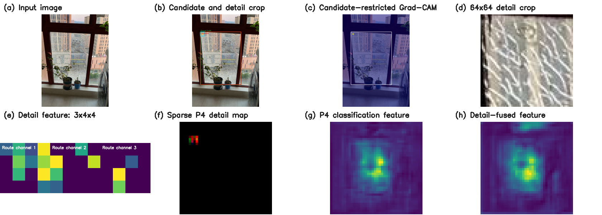

# P4 细节融合框架图可视化素材

更新时间：2026-08-23

本目录提供可直接放入论文框架图的真实模型可视化素材，覆盖输入图像、候选框、P4 Grad-CAM、`64×64`细节截图、`3×4×4` Detail特征、P4稀疏回填图、原始P4特征、融合特征和最终检测结果。

> 如果论文主图要求“从建筑外侧拍摄玻璃”、展示全部`conf>0.2`候选及逐候选截图，并直观看到相对`best318.pt`的改进，请优先使用新整理的[`00587.jpg`室外案例](P4_EXTERIOR_IMPROVEMENT_VISUAL_ASSETS.md)。本页的`00456.jpg`继续保留，适合展示紧凑的完整张量路径。

素材目录：[`docs/assets/p4_framework_visuals/`](assets/p4_framework_visuals/)

## 1. 选图结论

本组完整张量路径素材使用测试集样本 `00456.jpg`，而不是使用此前failure audit中的样本。选择原因：

- 只有一个主要破损玻璃区域，主体明确；
- 破损纹理密集，在缩小后的论文图中仍能识别；
- 目标区域位于画面中部，没有贴边；
- P4模型最终只输出一个 `conf>0.5` 检测框；
- 选中的原始候选框与标注框IoU为 `0.986573`；
- 选中的`64×64` Detail截图中可以清楚看到裂纹纹理；
- 原图、热图、局部截图和特征图的颜色差异明显，适合横向方法框架图。

生成素材使用已完成并统一测试的P4可学习alpha `best.pt`。候选生成、P4 Hook、Grad-CAM、Detail Encoder、空间回填及`Conv(67→64)`融合路径与P4固定alpha/直接融合实验相同；不同实验只在最终分类logit组合规则上存在差异。

## 2. 推荐直接使用的总览图



总览图包含：

1. 输入图像；
2. 候选框与Detail裁剪位置；
3. 候选框内Grad-CAM；
4. `64×64`细节截图；
5. `3×4×4` Detail三通道特征；
6. P4 `3×40×40`稀疏Detail图；
7. P4分类分支特征；
8. Detail融合后的P4特征。

总览图适合用于确认布局，正式论文图建议使用下面的独立原图素材重新排版，以便统一字体、线宽和箭头。

## 3. 独立图片及用途

| 文件 | 内容 | 框架图中的建议位置 |
| --- | --- | --- |
| [`01_input_image.jpg`](assets/p4_framework_visuals/01_input_image.jpg) | 未标注的原始测试图 | 最左侧 `Input Image` |
| [`02_candidate_and_detail_crop.jpg`](assets/p4_framework_visuals/02_candidate_and_detail_crop.jpg) | 标注框、预测候选框、Grad-CAM中心和`64×64`裁剪框 | `Candidate Selection`与`Detail Crop Generator`之间 |
| [`03_p4_gradcam_overlay.jpg`](assets/p4_framework_visuals/03_p4_gradcam_overlay.jpg) | 原始全图P4 Grad-CAM叠加 | 展示网络的全局响应，可放附图 |
| [`03b_candidate_restricted_gradcam.jpg`](assets/p4_framework_visuals/03b_candidate_restricted_gradcam.jpg) | 将同一真实CAM限制在所选候选框内并重归一化 | 主框架图的`Grad-CAM Localization`节点 |
| [`04_detail_crop_64.png`](assets/p4_framework_visuals/04_detail_crop_64.png) | 模型实际使用的`64×64` Detail输入 | 需要保留真实像素时使用 |
| [`05_detail_crop_preview.png`](assets/p4_framework_visuals/05_detail_crop_preview.png) | `64×64`截图的最近邻放大预览 | 论文框架图中的Detail截图 |
| [`06_detail_feature_channels.png`](assets/p4_framework_visuals/06_detail_feature_channels.png) | Detail输出的三个`4×4`通道 | `Three-route Detail Encoder`输出端 |
| [`07_detail_feature_rgb.png`](assets/p4_framework_visuals/07_detail_feature_rgb.png) | 三通道Detail特征的RGB组合 | 需要一个紧凑特征方块时使用 |
| [`08_sparse_detail_map_p4.png`](assets/p4_framework_visuals/08_sparse_detail_map_p4.png) | 所选候选的`3×4×4`特征回填到`3×40×40`零图 | `Coordinate-aware Scatter-and-Add`输出端 |
| [`09_p4_activation_mean.png`](assets/p4_framework_visuals/09_p4_activation_mean.png) | `Detect.cv3[1][1]`的64通道绝对值均值 | YOLO P4分类特征输入端 |
| [`10_fused_feature_mean.png`](assets/p4_framework_visuals/10_fused_feature_mean.png) | `Conv(67→64)+BN+ReLU`后的64通道绝对值均值 | Detail–YOLO融合模块输出端 |
| [`11_final_detection.jpg`](assets/p4_framework_visuals/11_final_detection.jpg) | `conf=0.5, IoU=0.5`后的最终检测结果 | 最右侧 `Final Detection` |
| [`12_framework_visual_overview.png`](assets/p4_framework_visuals/12_framework_visual_overview.png) | 八个关键阶段的横向总览 | 草图、答辩或排版参考 |
| [`metadata.json`](assets/p4_framework_visuals/metadata.json) | 样本、模型、候选框、IoU和张量尺寸 | 复核与引用数据 |

## 4. 候选框图颜色说明

`02_candidate_and_detail_crop.jpg`使用：

- 绿色：数据集ground-truth框；
- 红色：与ground truth匹配度最高的真实YOLO候选框；
- 青色：以Grad-CAM中心为中心的`64×64`裁剪范围；
- 黄色点：候选框内部最大热响应窗口的中心。

对应数值：

| 项目 | 数值 |
| --- | --- |
| 原图尺寸 | `1013×1394` |
| 内部候选阈值 | `0.2` |
| 原始候选数量 | `10` |
| 选中候选与标注IoU | `0.986573` |
| 最终检测数量 | `1` |
| 最终检测显示置信度 | `0.974` |
| Hook | `Detect.cv3[1][1]` |
| P4 Hook特征 | `64×40×40` |
| Detail截图 | `3×64×64` |
| Detail输出 | `3×4×4` |
| 融合输出 | `64×40×40` |

## 5. Grad-CAM图片的区别

`03_p4_gradcam_overlay.jpg`是网络对整张图像产生的真实P4 Grad-CAM。当前Grad-CAM目标是全图所有检测位置类别置信度之和，因此全图最强响应不一定处于当前选中的候选框内。

实际截图定位会在每个候选框内部单独搜索最大热响应窗口。为在结构图中清楚表达这一过程，`03b_candidate_restricted_gradcam.jpg`对同一真实CAM执行以下仅用于显示的处理：

1. 保留选中候选框内部的CAM；
2. 将候选框外部置零；
3. 对保留区域重新归一化；
4. 叠加候选框和实际选中的Grad-CAM中心。

该图没有重新运行或修改模型，只是对真实CAM做候选区域显示处理。正式论文主框架图建议使用`03b`，全局CAM可放在附图或定性分析中。

## 6. 特征图的显示处理

原始模型特征不能直接作为RGB图片显示，因此使用以下可重复的显示规则：

- `06_detail_feature_channels.png`：三个`4×4`通道分别归一化并使用Viridis颜色映射；
- `07_detail_feature_rgb.png`：把三个Detail通道映射到RGB并进行全局归一化；
- `08_sparse_detail_map_p4.png`：只显示所选代表候选的空间回填，以便观察`4×4`特征块在`40×40`网格中的位置；完整前向实际会回填全部10个候选；
- `09_p4_activation_mean.png`：对P4 Hook的64个通道取绝对值均值，再归一化；
- `10_fused_feature_mean.png`：对融合后64个通道取绝对值均值，再归一化。

这些归一化只用于绘图，不会参与模型前向或指标计算。

## 7. 正式框架图的推荐组合

如果论文版面有限，推荐只使用以下六张：

```text
01_input_image.jpg
  → 02_candidate_and_detail_crop.jpg
  → 03b_candidate_restricted_gradcam.jpg
  → 05_detail_crop_preview.png
  → 06_detail_feature_channels.png
  → 08_sparse_detail_map_p4.png
```

随后使用抽象模块框表示：

```text
Concat(64+3 channels)
→ Conv3×3(67→64) + BN + ReLU
→ P4 Conv1×1 Classifier
→ direct/fixed-alpha/learnable-alpha logit rule
→ Final Detection
```

可将`09_p4_activation_mean.png`和`10_fused_feature_mean.png`分别放在Concat前后，直观显示融合引起的特征响应变化；最右侧使用`11_final_detection.jpg`。

## 8. 相关文档与复现代码

- 室外玻璃、全部候选与基线改进对比：[P4_EXTERIOR_IMPROVEMENT_VISUAL_ASSETS.md](P4_EXTERIOR_IMPROVEMENT_VISUAL_ASSETS.md)
- 结构、尺寸和生成Prompt：[P4_LEARNABLE_ALPHA_DETAIL_FUSION_ARCHITECTURE.md](P4_LEARNABLE_ALPHA_DETAIL_FUSION_ARCHITECTURE.md)
- 指标和权重：[GRADCAM_DETECT_HEAD_EXPERIMENT_RESULTS.md](GRADCAM_DETECT_HEAD_EXPERIMENT_RESULTS.md)
- 可视化导出脚本：[实验分支中的`export_p4_framework_visuals.py`](https://github.com/zing-c/BGD-Yolo-v2/blob/experiment/best318-multihead-direct/experiments/export_p4_framework_visuals.py)
