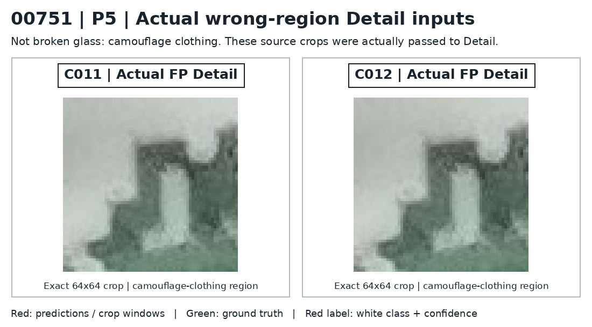
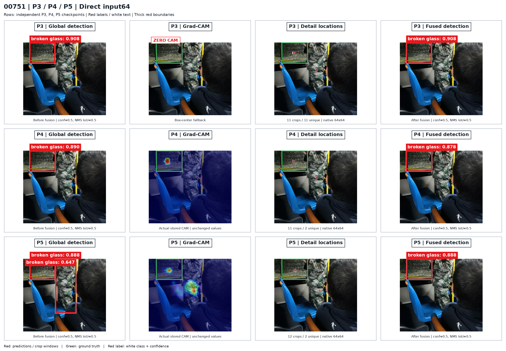

# 00751：P5 真实误检消除例子

使用当前完成 50 epoch 的 P3 / P4 / P5 三个独立单头 Val best.pt，**不是正在训练的多头模型**。在每个头完整扫描 1,598 张 Test 图片后，00751 / P5 符合“错误位置 conf>0.5，融合后低于 0.5 且正确检测保留”的严格条件。

这是**车内场景**，不是外拍建筑。左上方是破损玻璃；中间迷彩衣服区域原本被误检。融合前来自同一个联合 checkpoint 的第一次全局 forward，不是独立 YOLO 或 318.pt 基线。

[完整筛查与核验说明](../../DIRECT_INPUT64_FP_SUPPRESSION_SEARCH_20260916.md) · [四张外拍图片清晰版](../direct_input64_head_visuals_20260916_pretty/README.md)

## P5：0.647→0.234，最终 conf=0.5 时误检框消失

[高清无损 PNG](00751/p5/false_positive_suppression.png) · [P5 六联流程 PNG](00751/p5/paper_overview.png) · [真实 CAM](00751/p5/actual_cam_overlay.jpg) · [全部 conf>0.2 候选框](00751/p5/all_candidates_conf_gt02.jpg) · [实际误检区域截图 PNG](00751/p5/false_positive_detail_crops.png)

正确玻璃框置信度保持 **0.888**。TP/FP/FN 从 **1/1/0→1/0/0**。错误位置所有 IoU≥0.5 的原始候选 anchor 在融合后最高 score 也只有 **0.234**，所以不是只因 NMS 隐藏某个重复框。

这张图两个预测框靠近图片顶部，增加纯白显示留边；相邻标签分列框上沿两侧，仍紧贴框边，避免覆盖彼此文字。没有增加原图区域或修改框坐标；白边仅属于版式，不是模型实际输入。

## 实际传入 Detail 的迷彩区域截图

原生文件：[C011.png](00751/p5/detail_crops_64/C011.png) / [C012.png](00751/p5/detail_crops_64/C012.png)。两张都是实际推理输入，不是从绘制后的 JPEG 中再裁剪；此处仅 nearest-neighbor 放大显示。[P5 全部 12 张截图](00751/p5/detail_crops_64/) 与真实输入逐一对应。

P5 CAM 非零，最强热点位于迷彩衣服区域；玻璃区域也有响应。不能把本图描述成 CAM 只关注正确玻璃。可以用它说明“全局易混淆纹理→真实 CAM / 原图 Detail 截图→实际融合后抑制错误位置”的方法过程；单张图不替代整体实验或因果消融。

## 三个单头同图比较

[无损 PNG](00751/comparison.png) · [P3 完整流程](00751/p3/paper_overview.png) · [P4 完整流程](00751/p4/paper_overview.png) · [P5 完整流程](00751/p5/paper_overview.png)

只有 **P5** 在本张图的同权重融合前后消除了此误检。P3/P4 原本就没有这个 conf=0.5 的错误框，不可跨头对比来冒充同模型融合效果。P3 CAM 全零并明确标记，P4/P5 有真实响应。

## 文件与数据

各头保存融合前后框、CAM / 灰度 CAM、实际截图位置、截图拼图、全部候选框和六联流程 JPG/PNG。原生截图总数 34 张（P3=11、P4=11、P5=12），与只读导出原 PNG 字节一致；各头 `metadata.json` 保留原始坐标、未舍入 confidence 和对应权重位置 / SHA256。

[P5 误检核验 JSON](00751/p5/false_positive_audit.json) · [P5 metadata](00751/p5/metadata.json) · [重绘校验记录](render_manifest.json)

固定条件：candidate>0.2、最终 conf=0.5、NMS IoU=0.5、FP32、实际 rectangular letterbox、无 alpha、sum。仅原始已验证数据的重绘与展示，模型、CAM target、融合逻辑、权重、阈值均未改变。未上传 NPZ、训练源码、渲染源码或权重二进制。
