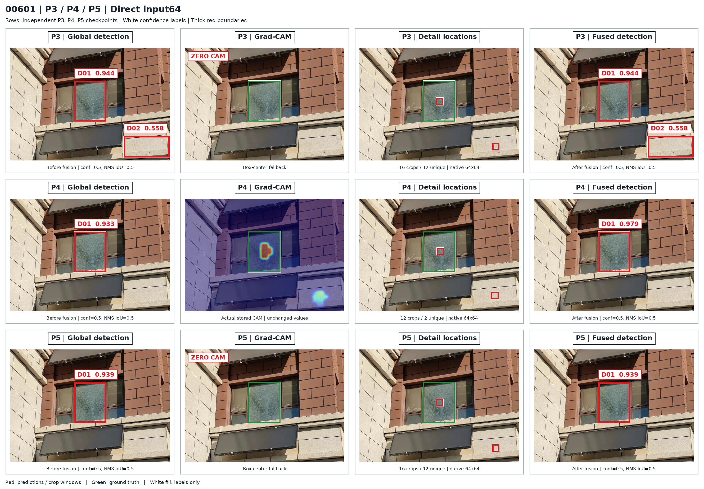
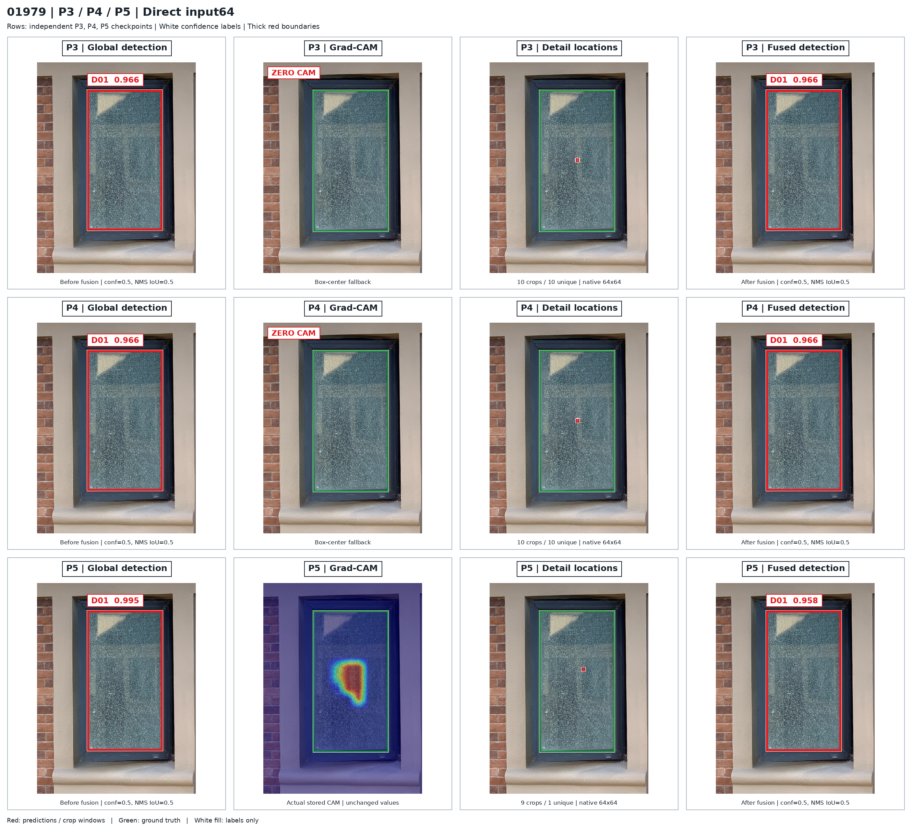

# 00601 / 01979：清晰排版版可视化

按用户选定的两张 Test 图片重新排版，使用当前完成 50 epoch 的 P3、P4、P5 三个独立单头 Val best.pt 的**已保存结果**。这次只重绘显示样式，没有重新推理、调整方法、更新权重或修改 CAM。

图片位于 GitHub **main / docs / assets / direct_input64_head_visuals_20260916_pretty**。[完整实验与可视化说明](../../DIRECT_INPUT64_HEADS_VISUALS_20260916.md) · [旧版六张图片](../direct_input64_head_visuals_20260916_r1/README.md)

## 样式

- 检测框统一粗红线，外加细白轮廓；小截图窗口控制线宽，不用加粗填满截图区域。
- 顶部标题、框旁编号与置信度均使用白底矩形、清晰深色 / 红色粗体字；**只有标签矩形内部填白，检测框 / 截图框内部不填白**。
- 先缩放干净图像再画框和文字，避免原图尺寸较大时文字被一起缩小。
- 比较图及完整流程图同时提供高清无损 PNG 与浏览用 JPG。PNG 写入 300 dpi，实际像素尺寸仍以文件为准；不存在凭空增加原图细节。
- 原 CAM 为零时如实标注 `ZERO CAM` 和框中心回退，不人为添加热点。

## 00601：三个单头比较

行：P3、P4、P5。列：融合前全局检测、真实 CAM、实际 Detail 截图位置、融合后检测。

[高清无损 PNG](00601/comparison.png) · [P4 六联流程 JPG](00601/p4/paper_overview.jpg) · [P4 六联流程 PNG](00601/p4/paper_overview.png) · [P4 全部 conf>0.2 候选框](00601/p4/all_candidates_conf_gt02.jpg) · [P4 全部实际 64×64 截图](00601/p4/detail_crops_64/)

建议框架图使用 **00601 / P4**：CAM 有真实有效响应，正确框置信度从 0.933 变为 0.979。前后 TP/FP/FN 相同，这不等于消除误检。P3 的额外错误位置框仍保留，P3/P5 的 CAM 为零。

## 01979：三个单头比较

[高清无损 PNG](01979/comparison.png) · [P5 六联流程 JPG](01979/p5/paper_overview.jpg) · [P5 六联流程 PNG](01979/p5/paper_overview.png) · [P5 全部 conf>0.2 候选框](01979/p5/all_candidates_conf_gt02.jpg) · [P5 全部实际 64×64 截图](01979/p5/detail_crops_64/)

建议框架图使用 **01979 / P5** 展示有效 CAM 和实际截图位置。P3/P4 的 CAM 为零。P5 正确框置信度实际从 0.995 变为 0.958；TP/FP/FN 相同，不能称为检测性能提升。

## 可用素材与真实性校验

每张图片的 `p3/`、`p4/`、`p5/` 都保留融合前后框、CAM 叠加图、灰度 CAM、原图截图范围、截图拼图、六联流程、全部 conf>0.2 原始 pre-NMS 候选框及 metadata。候选框与最终框口径不同：候选为 score>0.2、未做 NMS；最终框为 conf=0.5、NMS IoU=0.5。

`detail_vs_global_same_region.jpg` 沿用旧版真实同区域纹理对照，不重新合成。`detail_crops_64/` 保存全部实际截图，包括重复输入；00601 共 44 张、01979 共 29 张，PNG 文件与原导出字节完全一致。

六组 `metadata.json` 也与原导出字节完全一致，保存真实原图坐标和未舍入置信度。显示图中的标签保留三位小数，坐标按面板尺寸缩放；这不修改原始数据。记录见 [render_manifest.json](render_manifest.json)。CAM 读取本地原始浮点数组后按原叠加公式绘制，不增强数值、移动热点或改变归一化。

融合前是**同一个联合 checkpoint 的第一次全局 forward**，不是独立训练的 YOLO 基线。两张图片所有单头前后的 TP/FP/FN 均没有变化；用于方法过程的真实展示，不作为纠正误检 / 补回漏检的证据。

本次发布仅含图片、MD 和 JSON；原始 NPZ、训练源码、渲染代码和权重文件不随这些图片上传。旧版图片目录保持不变。
