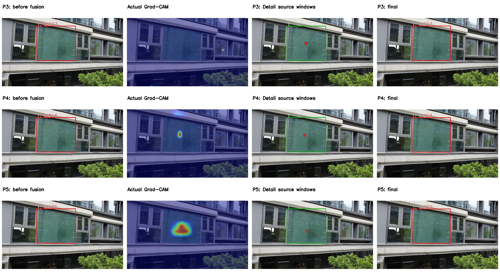

# 当前 P3 / P4 / P5 单头可视化图片

六张 Test 图片，各使用本轮 P3/P4/P5 Val best.pt，共 18 组。图片位于 GitHub **main 分支 docs/assets/direct_input64_head_visuals_20260916_r1/**。

[完整说明、文件用途与数值结论](../../DIRECT_INPUT64_HEADS_VISUALS_20260916.md) · [单头 Test 指标与权重位置](../../DIRECT_INPUT64_HEADS_TEST_RESULTS_20260916.md)

## 00586：外拍建筑玻璃，三个单头对比

行：P3 / P4 / P5。列：融合前全局分支 / 实际 Grad-CAM / 原图 Detail 截图范围 / 最终检测。红框为预测或截图范围，绿框为标注。

## P4 完整流程与同区域纹理对照

[P4 全部真实 64×64 截图](00586/p4/detail_crops_64/) · [P4 全部 conf>0.2 候选框](00586/p4/all_candidates_conf_gt02.jpg) · [P4 最终检测](00586/p4/final_after_fusion.jpg)

## 其他同图比较

- [00587：外拍窗户，弱响应 / 零值对照](00587/comparison.jpg)
- [00039：远处玻璃幕墙](00039/comparison.jpg)
- [00601：窗户与仍保留的错误位置框](00601/comparison.jpg)
- [01979：P5 有效热点与 P3/P4 零值对照](01979/comparison.jpg)
- [00970：玻璃顶、多目标 / 漏检对照](00970/comparison.jpg)

每个图片编号下都有 `p3/`、`p4/`、`p5/`，包含热力图、真实截图、候选框、最终框、完整流程图和对应 metadata。`results.json` 汇总实际权重 hash、CAM 值、坐标与检测统计。JPG/PNG 图片均已列入发布；NPZ 数组和导出源码仅保留本地。

注意：融合前是同一联合 checkpoint 的第一次全局 forward，不是独立 YOLO 基线。本批 6/18 CAM 全零，已标注，未伪造热点。这批样例融合前后 TP/FP/FN 未改善，只用于真实方法过程与纹理展示，不能作为消除误检的证据。
