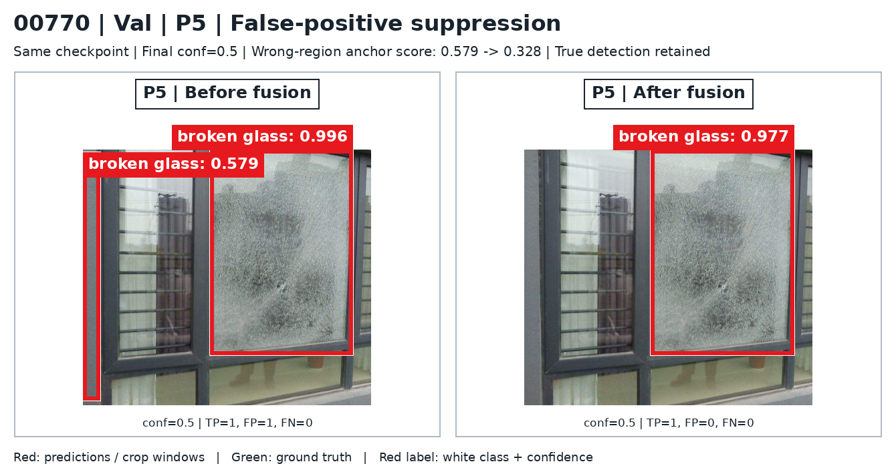
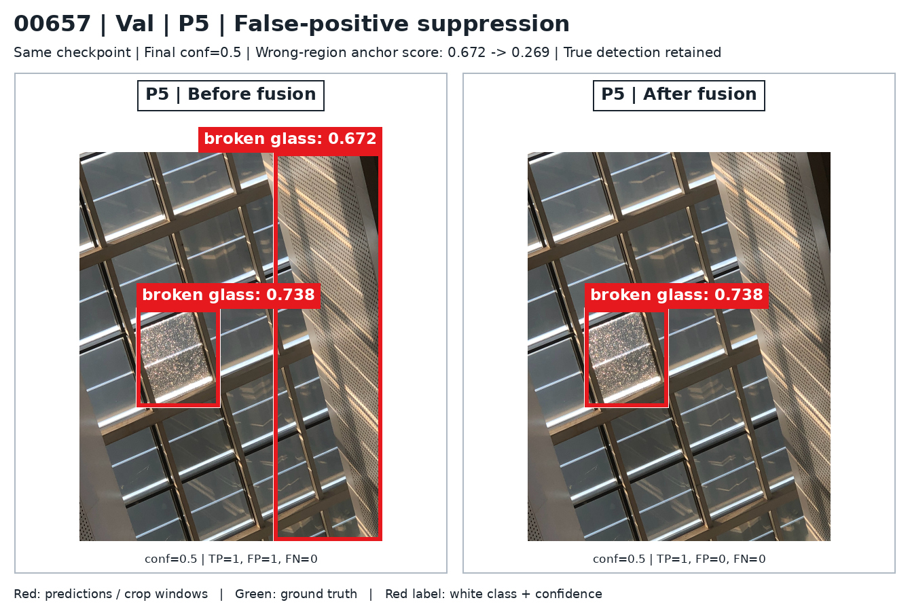
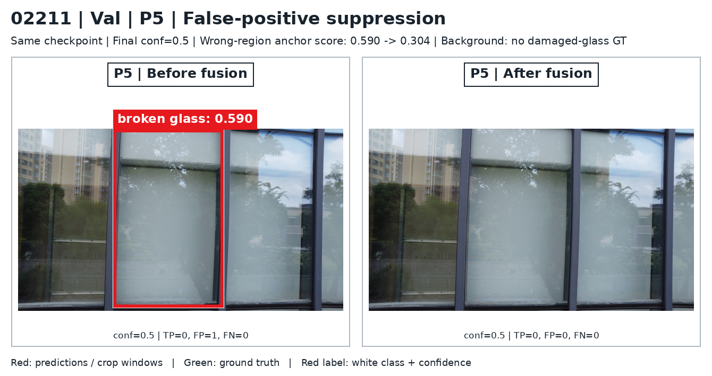

# Val 误检抑制：00770 / 00657 / 02211

[实验解释与逐 anchor 核验](../../DIRECT_INPUT64_VAL_FP_SUPPRESSION_20260916.md)。当前已完成 P3/P4/P5 单头，各自固定 Val best.pt；不是三头训练。融合前是同一 checkpoint 的第一次全局 forward，不是独立 YOLO 基线。

P5 在最终 conf=0.5 下的新例子：

| 图片 | 内容 | 原误检 anchor 分数前→后 | 对比与流程 |
|---|---|---|---|
| 00770 | 建筑窗户左侧墙边 / 窗框误检，正确玻璃保留 | 0.579→0.328 | [对比 PNG](00770/p5/false_positive_suppression.png) · [流程 PNG](00770/p5/paper_overview.png) · [三单头比较](00770/comparison.jpg) |
| 00657 | 玻璃顶旁带孔面板误检，正确玻璃保留 | 0.672→0.269 | [对比 PNG](00657/p5/false_positive_suppression.png) · [流程 PNG](00657/p5/paper_overview.png) · [三单头比较](00657/comparison.jpg) |
| 02211 | 外拍反光窗户背景，没有破损 GT；最终无框 | 0.590→0.304 | [对比 PNG](02211/p5/false_positive_suppression.png) · [流程 PNG](02211/p5/paper_overview.png) · [三单头比较](02211/comparison.jpg) |

## 实际热力图、截图与所有 conf>0.2 框

| 图片 | 实际 P5 CAM | 原误检候选实际 Detail 输入 | 全部原生 64×64 PNG | 全部 pre-NMS conf>0.2 框 | 原始检测记录 |
|---|---|---|---|---|---|
| 00770 | [热力图](00770/p5/actual_cam_overlay.jpg) | [实际截图](00770/p5/false_positive_detail_crops.jpg) | [PNG 目录](00770/p5/detail_crops_64/) | [候选框](00770/p5/all_candidates_conf_gt02.jpg) | [metadata](00770/p5/metadata.json) |
| 00657 | [热力图](00657/p5/actual_cam_overlay.jpg) | [实际截图](00657/p5/false_positive_detail_crops.jpg) | [PNG 目录](00657/p5/detail_crops_64/) | [候选框](00657/p5/all_candidates_conf_gt02.jpg) | [metadata](00657/p5/metadata.json) |
| 02211 | [热力图](02211/p5/actual_cam_overlay.jpg) | [实际截图](02211/p5/false_positive_detail_crops.jpg) | [PNG 目录](02211/p5/detail_crops_64/) | [候选框](02211/p5/all_candidates_conf_gt02.jpg) | [metadata](02211/p5/metadata.json) |

每张图的 `p3/`、`p4/`、`p5/` 均保留真实结果、完整流程 PNG、所有原生截图和 metadata。P3 在 00657/00770 的 CAM 全零，保持原样并标明回退；P4 在 02211 的误检没有消除，不能称所有头都有效。

红框、贴框的 `broken glass: 0.579` 红底白字；检测区域不填色。上方 42 像素白色留边仅方便顶部标签显示，显示坐标相应偏移，原始图片坐标 / 分数 / CAM 不变。真实截图逐字节复制，放大预览采用 nearest-neighbor；误检候选截图可能只覆盖该错误框的一小部分，不假称整框裁剪。

[渲染保真 JSON](render_manifest.json) · [完整 Val 筛查 JSON](../../results/direct_input64_val_fp_suppression_search_20260916.json) · [Test 00751/P5](../direct_input64_fp_suppression_20260916_r1/README.md) · [00601 等原选定图片](../direct_input64_head_visuals_20260916_pretty/README.md)
